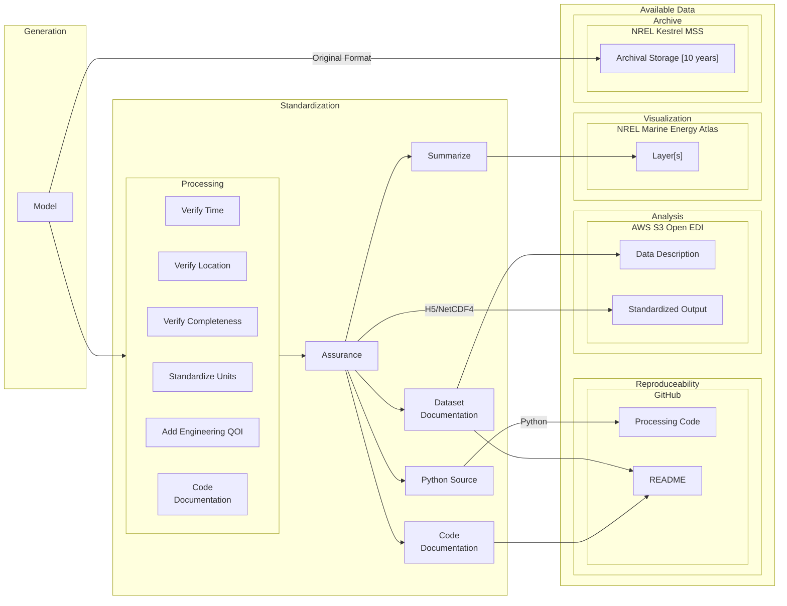
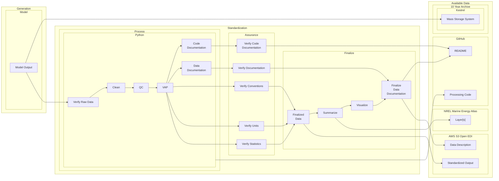

# Marine Energy Resource Characterization

## Overview

The Marine Energy Resource Characterization project is a collaboration between the [National
Renewable Energy Laboratory][NREL] (NREL), [Sandia National Laboratories][SNL] (SNL), and [Pacific Northwest
National Laboratory][PNNL] (PNNL). This multi-laboratory initiative leverages high-performance computing to
build computational fluid dynamics models of ocean conditions. The resulting simulations, combined
with field measurements, aim to create a comprehensive understanding of the marine energy resource
in the United States. The data produced through this collaboration helps de-risk deployments and
provides a foundation for device design decisions.

This repository contains tools and workflows that process, standardize, and disseminate model
outputs to guide marine energy deployments. The software converts model outputs into documented
datasets that follow industry conventions ([IEC][IEC-TC114] and [CF (Climate Forecast) standards][CF-Conventions]). The processing workflows handle
wave energy ([SWAN][SWAN], [WaveWatch III][WaveWatch]) and tidal energy ([FVCOM][FVCOM]) model outputs.

## Applications

The standardized datasets support:

- Analysis of operational and extreme conditions at potential deployment sites
- Model validation and comparison across different conditions
- Integration of site-specific hydrodynamic forces into device design
- Public access to marine energy resource data through the [Marine Energy Atlas][Marine Energy Atlas]

Quality control processes, standardized formatting, and documentation ensure the datasets meet scientific requirements for reproducibility.

## Repository Structure

```
- wave/
  - SWAN/
  - WaveWatchIII/
- tidal/
  - fvcom/
```

## Data Processing Workflow

### High Level Overview



### Detailed Process Flow



## Data Types and Storage

The project manages two primary classes of data:

| Type         | Format                                 | Size                       | Availability | Common Units | Ease of Use |
| ------------ | -------------------------------------- | -------------------------- | ------------ | ------------ | ----------- |
| Original     | [NetCDF][NetCDF], txt, csv, H5, custom | Varies, Typically Multi TB | On Request   | No           | Low         |
| Standardized | [H5][HDF5] or [NetCDF]                 | 300GB or smaller           | Public - AWS | Yes          | High        |

### Data Locations

- Original data is stored on the [NREL Kestrel HPC][Kestrel] system at `/projects/hindcastra`
- Public data is available on the NREL Kestrel HPC system at `/datasets/US_wave`
- Standardized datasets are accessible through [AWS S3 Open EDI][WPTOHindcast]
- Visualizations are available through the NREL Marine Energy Atlas

## Contributing

We welcome contributions from the community. Please:

- Open issues for bugs, feature requests, or suggestions
- Submit pull requests for proposed changes
- Follow our coding standards (detailed in each subfolder)
- Ensure all tests pass before submitting changes

## Installation

Specific installation requirements and dependencies are documented within each technology's subfolder (wave/SWAN, wave/WaveWatchIII, tidal/fvcom).

## License

This software is licensed under the BSD 3-Clause License. See the [LICENSE](LICENSE) file for details.

Copyright 2024 Alliance for Sustainable Energy, LLC

NOTICE: This software was developed at least in part by Alliance for Sustainable Energy, LLC
("Alliance") under Contract No. DE-AC36-08GO28308 with the U.S. Department of Energy and the U.S.
Government retains for itself and others acting on its behalf a nonexclusive, paid-up, irrevocable
worldwide license in the software to reproduce, prepare derivative works, distribute copies to the
public, perform publicly and display publicly, and to permit others to do so.

## Contact

Please use GitHub issues for bug reports and feature requests. For other inquiries, contact the NREL Marine Energy team.

<!-- National Labs -->

[NREL]: https://www.nrel.gov
[SNL]: https://www.sandia.gov
[PNNL]: https://www.pnnl.gov
[DOE]: https://www.energy.gov

<!-- Project Resources -->

[Marine Energy Atlas]: https://maps.nrel.gov/marine-energy-atlas
[OpenEI]: https://openei.org/wiki/Marine_and_Hydrokinetic_Technology_Database
[WPTO]: https://www.energy.gov/eere/water/water-power-technologies-office
[WPTOHindcast]: https://registry.opendata.aws/wpto-pds-us-wave/

<!-- High Performance Computing -->

[Kestrel]: https://www.nrel.gov/hpc/kestrel-computing-system.html
[Eagle]: https://www.nrel.gov/hpc/eagle-system.html

<!-- Models -->

[SWAN]: https://swanmodel.sourceforge.io
[WaveWatch]: https://github.com/NOAA-EMC/WW3
[FVCOM]: http://fvcom.smast.umassd.edu/fvcom

<!-- Standards -->

[IEC-TC114]: https://www.iec.ch/dyn/www/f?p=103:7:::::FSP_ORG_ID:1316
[CF-Conventions]: https://cfconventions.org

<!-- Data Formats -->

[NetCDF]: https://www.unidata.ucar.edu/software/netcdf
[HDF5]: https://www.hdfgroup.org/solutions/hdf5

<!-- Additional Resources -->

[MHKiT]: https://github.com/MHKiT-Software/MHKiT
[PRIMRE]: https://primre.org
[IEA-OES]: https://www.ocean-energy-systems.org
[ESSI]: https://www.energy.gov/eere/water/energy-storage-systems-integration
