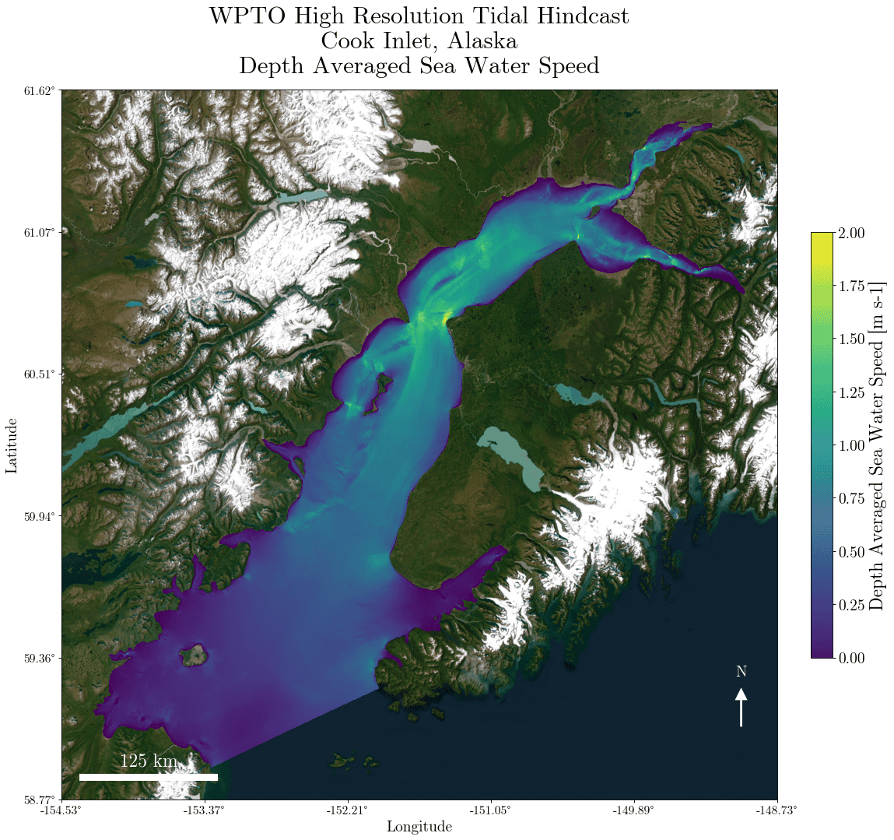
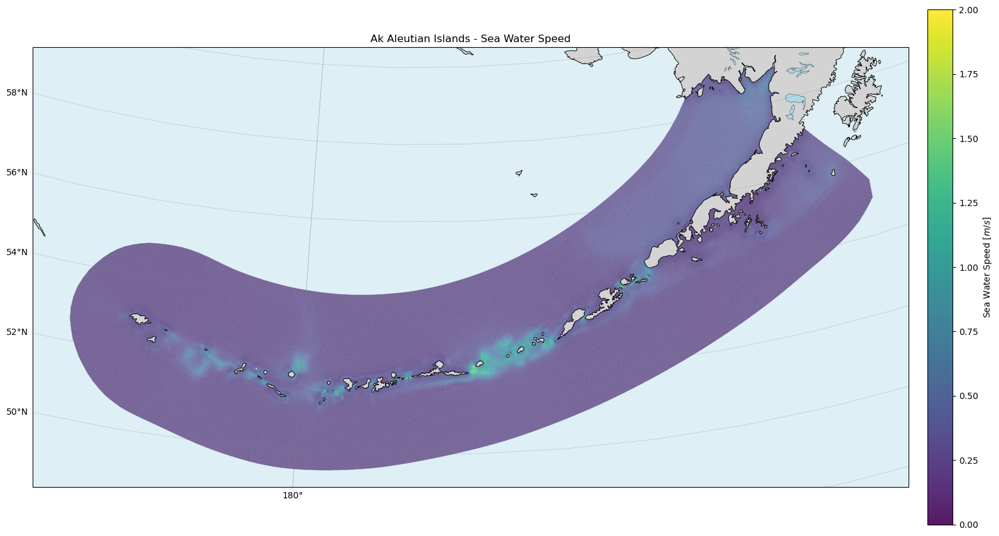
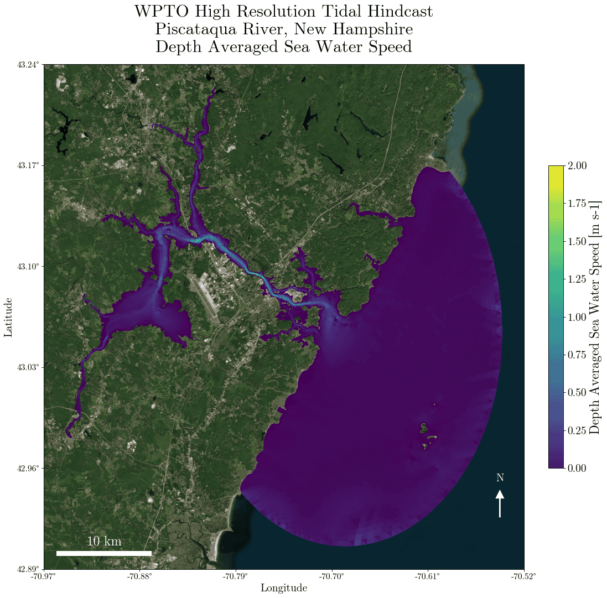
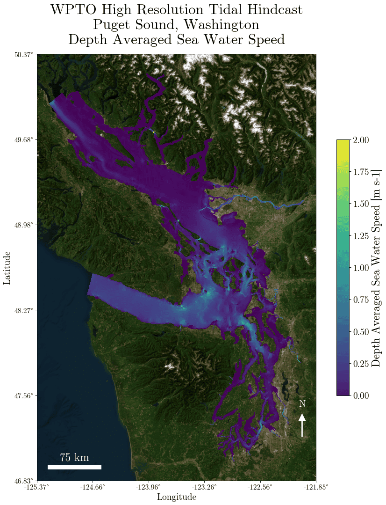

# WPTO High Resolution Tidal Hindcast

2025-06-24

- [<span class="toc-section-number">1</span> Overview](#overview)
- [<span class="toc-section-number">2</span> Versions](#versions)
- [<span class="toc-section-number">3</span> Tidal Data
  Overview](#tidal-data-overview)
- [<span class="toc-section-number">4</span> Location
  Details](#location-details)
- [<span class="toc-section-number">5</span> HPC Data
  Locations](#hpc-data-locations)
- [<span class="toc-section-number">6</span> Model Data
  Specification](#model-data-specification)
- [<span class="toc-section-number">7</span> Data Quality Assurance and
  Quality Control](#data-quality-assurance-and-quality-control)
- [<span class="toc-section-number">8</span> Derived Variables, Value
  Added Products (VAP)](#derived-variables-value-added-products-vap)
- [<span class="toc-section-number">9</span> Data Quality Assurance and
  Quality Control](#data-quality-assurance-and-quality-control-1)
- [<span class="toc-section-number">10</span> Data Levels and Processing
  Pipeline](#data-levels-and-processing-pipeline)
- [<span class="toc-section-number">11</span> Running Standardization
  Code](#running-standardization-code)
- [<span class="toc-section-number">12</span> Included
  Metadata](#included-metadata)
- [<span class="toc-section-number">13</span> Visualization
  Specification](#visualization-specification)
- [<span class="toc-section-number">14</span> Marine Energy Atlas
  Visualization
  Specification](#marine-energy-atlas-visualization-specification)
- [<span class="toc-section-number">15</span> ME Atlas High Resolution
  Tidal Data QOI Visualization
  Specification](#me-atlas-high-resolution-tidal-data-qoi-visualization-specification)
- [<span class="toc-section-number">16</span>
  Acknowledgement](#acknowledgement)
- [<span class="toc-section-number">17</span> Citation](#citation)
- [<span class="toc-section-number">18</span> References](#references)

# Overview

This repository contains the code and methodology for processing and
visualizing the U.S. Department of Energy (DOE) Water Power Technologies
Office (WPTO) high-resolution tidal hindcast data generated using the
Finite Volume Community Ocean Model (FVCOM) at five strategically
selected U.S. coastal locations. The project represents a collaborative
effort between the [Pacific Northwest National
Laboratory](https://www.pnnl.gov/marine-energy-resource-characterization)
(PNNL) (data generation) and the [National Renewable Energy
Laboratory](https://www.nrel.gov/water/resource-characterization) (data
processing and visualization), to generate, standardize, and summarize
original high resolution tidal data into accessible resource data for
tidal resource characterization. Complete standardized and summarized
datasets can downloaded from [Amazon Web Services Open Data
Registry](https://registry.opendata.aws/wpto-pds-us-tidal/), and summary
data is visualized on the [Marine Energy
Atlas](https://maps.nrel.gov/marine-energy-atlas/data-viewer/data-library/layers?vL=WavePowerMerged).

# Versions

| Asset                             | Status         | Version |
|-----------------------------------|----------------|---------|
| Processing Code (This Repository) | In Development | 0.3.0   |
| Public Dataset                    | Not Released   | 0.3.0   |
| Working Dataset                   | In Development | 0.4.0   |

# Tidal Data Overview

<div id="tbl-hrth-overview">

| Label | Specification |
|----|----|
| Project Title | High Resolution Tidal Hindcast |
| Project ID | `wpto_high_res_tidal` |
| Data Generation | Pacific Northwest National Laboratory (PNNL) |
| Data Processing and Visualization | National Renewable Energy Laboratory (NREL) |

Table 1: High Resolution Tidal Hindcast Overview

</div>

<div id="tbl-loc-overview">

<div class="cell-output cell-output-display cell-output-markdown">

| Location Name | Start Time \[UTC\] | End Time \[UTC\] | Sampling Frequency | Faces |
|:---|:---|:---|:---|---:|
| Aleutian Islands, Alaska | 2010-06-03 00:00:00 | 2011-06-02 23:00:00 | Hourly | 797978 |
| Cook Inlet, Alaska | 2005-01-01 00:00:00 | 2005-12-31 23:00:00 | Hourly | 392002 |
| Piscataqua River, New Hampshire | 2007-01-01 00:00:00 | 2007-12-31 23:30:00 | Half-Hourly | 292927 |
| Puget Sound, Washington | 2015-01-01 00:00:00 | 2015-12-30 23:30:00 | Half-Hourly | 1734765 |
| Western Passage, Maine | 2017-01-01 00:00:00 | 2017-12-31 23:30:00 | Half-Hourly | 231208 |

</div>

Table 2: Location Overview

</div>

## Model Configuration

<div id="tbl-model-config">

| Model Configuration | Specification |
|----|----|
| Model | [Finite Volume Community Ocean Model (FVCOM) 4.3.1](htpps://www.fvcom.org) |
| Documentation | [Publicly Available Manual](https://etchellsfleet27.com/wp-content/uploads/2020/06/FVCOM_User_Manual_v3.1.6.pdf) |
| Dimensions | time, element, depth |
| Horizontal Resolution | Unstructured grid of triangles designed to fit complex shorelines. Majority of resolution within 50 to 500m for IEC 62600-201 Stage 1 Compliance |
| Vertical Resolution | 10 uniform sigma (depth) layers from the water surface to seafloor that vary the thickness of each layer as the surface water level changes |
| Horizontal Coordinates | Latitude, Longitude (EPGS:4386) |
| Vertical Datum | Mean sea level (MSL), NAVD88 |
| Temporal Resolution | 1 year at half-hourly or hourly (Cook Inlet, Aleutian Islands) intervals |
| Model Wetting & drying Feature | Activated |
| Mdel Boundary forcing | 12 tidal constituents from OSU TPXO Tide Models |
| Model Wind | ERA5 or CFSv2 |

Table 3: High Resolution Tidal Hindcast FVCOM Specification and
Configuration

</div>

## IEC Standards Compliance

<div id="tbl-iec-compliance">

| IEC Standards (IEC TS 62600-201, 2015) | Compliance Status |
|----|----|
| Stage 1 (feasibility) tidal resource assessment requirements | Meet all requirements except those listed below |
| Wave-current interaction | Not considered because wave is small in the study domain |
| Atmospheric forcing (Wind and pressure) | Not considered because effects of wind and atmospheric pressure on tidal currents in the domain is negligible |
| Seawater density, salinity and temperature | Not considered because density-induced estuarine flow is small in the domain |

Table 4: High Resolution Tidal Hindcast IEC Standards Compliance

</div>

## Available Data Variables

<div id="tbl-model-config">

| Long Name | Units | Dimensions | Description |
|----|----|----|----|
| Eastward Sea Water Velocity | m/s | face, sigma_layer, time | Eastward component of sea water velocity |
| North Sea Water Velocity | m/s | face, sigma_layer, time | Northward component of sea water velocity |
| Sea Water Speed | m/s | face, sigma_layer, time | Speed calculated from u and v vectors |
| Depth Averaged Sea Water Speed | m/s | face, time | Mean of `vap_sea_water_speed` |
| Sea Water To Direction | Degrees CW from True North | face, sigma_layer, time | To Direction calculated from u and v vectors |
| Depth Averaged Sea Water To Direction | Degrees CW from True North | face, sigma_layer, time | Mean of `vap_sea_water_to_direction` |
| Surface Elevation | m \[from [NAVD88](https://en.wikipedia.org/wiki/North_American_Vertical_Datum_of_1988)\] | face, time | Distance from surface elevation to NAVD88 elevation |
| Layer Depth | m (From Surface Elevation) | face, sigma_layer, time | Northward component of sea water velocity |
| Sea Floor Depth | m (From Surface Elevation) | face, time | Northward component of sea water velocity |

Table 5: High Resolution Tidal Hindcast Variables

</div>

<div id="tbl-model-config">

| Long Name | NC Variable |
|----|----|
| Eastward Sea Water Velocity | `u` |
| North Sea Water Velocity | `v` |
| Sea Water Speed | `vap_sea_water_speed` |
| Depth Averaged Sea Water Speed | `vap_water_column_sea_water_speed` |
| Sea Water To Direction | `vap_sea_water_to_direction` |
| Depth Averaged Sea Water To Direction | `vap_water_column_sea_water_to_direction` |
| Surface Elevation | `vap_zeta_center` |
| Layer Depth | `vap_sigma_layer_depth` |
| Sea Floor Depth | `vap_depth` |

Table 6: High Resolution Tidal Hindcast Variables

</div>

5 US locations of new high resolution 3D tidal data, generated using
FVCOM version 4.3.1, with `u` and `v` vectors, and calculated
`sea_water_speed`, `sea_water_to_direction`, and
`sea_water_power_density` at 10 sigma layers:

<div id="fig-ak-cook-speed">



Figure 1: Cook Inlet, Alaska - Sea Water Speed, Yearly Average, Depth
Average

</div>

<div id="fig-ak-aleutian-speed">



Figure 2: Aleutian Islands - Sea Water Speed, Yearly Average, Depth
Average

</div>

<div id="fig-me-west-speed-speed">


Figure 3: Western Passage, Maine - Sea Water Speed, Yearly Average,
Depth Average

</div>

<div id="fig-nh-piscataqua-speed">



Figure 4: Piscataqua River New Hampshire - Sea Water Speed, Yearly
Average, Depth Average

</div>

<div id="fig-wa-puget-speed">



Figure 5: Puget Sound, Washington - Sea Water Speed, Yearly Average,
Depth Average

</div>

## Data Output Plan

| Data Level | Description | Format | Storage Location | Public Access |
|----|----|----|----|----|
| `00_raw` | Original NetCDF files from FVCOM model | NetCDF (nc) | HPC Kestrel, OpenEI AWS, NREL Stratus AWS | Yes |
| `a1_std` | Standardized data with consistent naming and attributes | NetCDF (nc) | HPC Kestrel | No |
| `a2_std_partition` | Standardized data partitioned by time chunks for processing | NetCDF (nc) | HPC Kestrel | No |
| `b1_vap` | Value-added products with derived variables, full temporal resolution | NetCDF (nc) | HPC Kestrel / OpenEI AWS | Yes |
| `b2_summary_vap` | Summary statistics of value-added products | NetCDF (nc) | HPC Kestrel | No |
| `b3_vap_partition` | Point data timeseries in a coordinate parquet partition | Parquet | HPC Kestrel | No |
| `b4_vap_summary_parquet` | Summary data in Parquet format for analytics | Parquet | HPC Kestrel / OpenEI AWS | Yes |
| `b5_vap_atlas_summary_parquet` | Subset of summary data for Marine Energy Atlas | Parquet | HPC Kestrel | No |

# Location Details

<div id="tbl-loc-spec">

<div class="cell-output cell-output-display cell-output-markdown">

| Location Name | Output Name | Input Directory |
|:---|:---|:---|
| Aleutian Islands, Alaska | AK_aleutian_islands | Aleutian_Islands_year |
| Cook Inlet, Alaska | AK_cook_inlet | Cook_Inlet_PNNL |
| Piscataqua River, New Hampshire | NH_piscataqua_river | PIR_full_year |
| Puget Sound, Washington | WA_puget_sound | Puget_Sound_corrected |
| Western Passage, Maine | ME_western_passage | Western_Passage_corrected |

</div>

Table 7: High Resolution Tidal Hindcast Available Locations

</div>

## Time Specification

<div id="tbl-loc-spec-time">

<div class="cell-output cell-output-display cell-output-markdown">

| Location Name | Data Start Time \[UTC\] | Data End Time \[UTC\] | Sampling Frequency | Time Count |
|:---|:---|:---|:---|---:|
| Aleutian Islands, Alaska | 2010-06-03 00:00:00 | 2011-06-02 23:00:00 | Hourly | 8760 |
| Cook Inlet, Alaska | 2005-01-01 00:00:00 | 2005-12-31 23:00:00 | Hourly | 8760 |
| Piscataqua River, New Hampshire | 2007-01-01 00:00:00 | 2007-12-31 23:30:00 | Half-Hourly | 17520 |
| Puget Sound, Washington | 2015-01-01 00:00:00 | 2015-12-30 23:30:00 | Half-Hourly | 17472 |
| Western Passage, Maine | 2017-01-01 00:00:00 | 2017-12-31 23:30:00 | Half-Hourly | 17520 |

</div>

Table 8: High Resolution Tidal Hindcast Time Specification

</div>

## Data Format

| Label                       | Specification   |
|-----------------------------|-----------------|
| File Format(s)              | NetCDF4, `*.nc` |
| Total Combined Dataset Size | ~10TB           |

## Original Data Volume Format

| Location | File Count | Directory Count | Total Data Volume | Average File Size | Duration Per File |
|----|----|----|----|----|----|
| AK, Aleutian Islands | 370 | 1 | 2.72 TB | 6.9 GB | 1 Day |
| AK, Cook Inlet | 366 | 1 | 1.31 TB | 3.4 GB | 1 Day |
| ME, Western Passage | 406 | 6 | 2.53 TB | 33 GB | 5 Days |
| NH, Piscataqua River | 370 | 1 | 1.60 TB | 4.1 GB | 1 Day |
| WA, Puget Sound | 83 | 13 | 3.33 TB | 45 GB | 5 Days |

## Temporal Details

| Label | Specification |
|----|----|
| Date/Time Format | modified julian day (MJD), `time`, UTC String, `Times` |
| Timezone | UTC |
| Expected Start Date | Varies by location (see below) |
| Expected End Date | Varies by location (see below) |
| Sampling Frequency, $\Delta t$ \[s\] | 1800s (30min) or 3600s (60min) by location |

### Location-Specific Temporal Details

| Location | Start Date | End Date | Temporal Resolution | $\Delta t$ \[s\] |
|----|----|----|----|----|
| Aleutian Islands | 2010-06-03 00:00:00 | 2011-06-02 23:00:00 | hourly | 3600 |
| Cook Inlet | 2005-01-01 00:00:00 | 2005-12-31 23:00:00 | hourly | 3600 |
| Western Passage | 2017-01-01 00:00:00 | 2017-12-31 23:30:00 | half-hourly | 1800 |
| Piscataqua River | 2007-01-01 00:00:00 | 2007-12-31 23:30:00 | half-hourly | 1800 |
| Puget Sound | 2015-01-01 00:00:00 | 2015-12-30 23:30:00 | half-hourly | 1800 |

## Spatial Details

| Label | Specification |
|----|----|
| Location Names | AK Aleutian Islands, AK Cook Inlet, ME Western Passage, NH Piscataqua River, WA Puget Sound |
| Coordinate Format | latitude/longitude or UTM (see below) |
| Grid Type | Unstructured triangular grid (FVCOM) |
| Grid Dimensions | Varies by location (nodes, elements/faces) |
| Grid Dimension Details | Nodes at vertices, elements/faces at centers |
| Spatial Uncertainty | Not Defined |

### Location-Specific Spatial Details

| Location         | Coordinate System  | Notes                    |
|------------------|--------------------|--------------------------|
| Aleutian Islands | latitude/longitude | Global coordinate system |
| Cook Inlet       | latitude/longitude | Global coordinate system |
| Western Passage  | UTM zone 19        | Local projection         |
| Piscataqua River | UTM zone 19        | Local projection         |
| Puget Sound      | UTM zone 10        | Local projection         |

## Dimension Details

| Label | Specification |
|----|----|
| Required Dimensions | time, node, nele/face, siglay/sigma_layer |
| Required Dimension Data Types | time: float32/datetime64, node: int64, nele/face: int64, siglay: float32 |
| Required Dimension Descriptions | time: temporal dimension, node: mesh vertices, nele/face: mesh elements, siglay: vertical sigma layers |
| Optional Dimensions | siglev, three, face_node_index |
| Optional Dimension Data Types | siglev: float32, three: int64, face_node_index: int64 |
| Optional Dimension Descriptions | siglev: sigma level interfaces, three: triangle connectivity, face_node_index: mapping between faces and nodes |

# HPC Data Locations

<div id="tbl-test">

<div class="cell-output cell-output-display cell-output-markdown">

| Type | Data Level | Name | Kestrel Path |
|:---|:---|:---|:---|
| Input | 00 | Original | `<location>/00_raw` |
| Output | A1 | Standardized | `<location>/a1_std` |
| Output | A2 | Standardized Partition | `<location>/a2_std_partition` |
| Output | B1 | Vap | `<location>/b1_vap` |
| Output | B2 | Monthly Summary Vap | `<location>/b2_monthly_mean_vap` |
| Output | B3 | Yearly Summary Vap | `<location>/b3_yearly_mean_vap` |
| Output | B4 | Vap Partition | `<location>/b4_vap_partition` |
| Output | B5 | Vap Summary Parquet | `<location>/b5_vap_summary_parquet` |
| Output | B6 | Vap Atlas Summary Parquet | `<location>/b6_vap_atlas_summary_parquet` |
| Output | Time | Tracking | `<location>/metadata/time_validation_and_tracking` |
| Output | Dataset | Attributes | `<location>/metadata/dataset_attributes` |
| Output | Sha | Sha 256 | `<location>/metadata/sha_256` |

</div>

Table 9: Available Data on Kestrel

</div>

# Model Data Specification

## Model Version Numbers

| Name          | Specification |
|---------------|---------------|
| Model Version | FVCOM_4.3.1   |
| Conventions   | CF-1.0        |

## Required Original Variables

These variables with the specified types must exist in the input
original datasets

<div id="tbl-req-orig-vrs">

<div class="cell-output cell-output-display cell-output-markdown">

| Variable | Data Type | Coordinates | Dimensions |
|:---|:---|:---|:---|
| time | float32 | \[‘time’\] | \[‘time’\] |
| Times | \|S26 | \[‘time’\] | \[‘time’\] |
| lat | float32 | \[‘lon’, ‘lat’\] | \[‘node’\] |
| lon | float32 | \[‘lon’, ‘lat’\] | \[‘node’\] |
| latc | float32 | \[‘lonc’, ‘latc’\] | \[‘nele’\] |
| lonc | float32 | \[‘lonc’, ‘latc’\] | \[‘nele’\] |
| x | float32 | \[‘lon’, ‘lat’\] | \[‘node’\] |
| y | float32 | \[‘lon’, ‘lat’\] | \[‘node’\] |
| xc | float32 | \[‘lonc’, ‘latc’\] | \[‘nele’\] |
| yc | float32 | \[‘lonc’, ‘latc’\] | \[‘nele’\] |
| nele | int64 | \[‘lonc’, ‘latc’\] | \[‘nele’\] |
| node | int64 | \[‘lon’, ‘lat’\] | \[‘node’\] |
| nv | int32 | \[‘lonc’, ‘latc’\] | \[‘three’, ‘nele’\] |
| three | int64 | \[\] | \[‘three’\] |
| zeta | float32 | \[‘lon’, ‘lat’, ‘time’\] | \[‘time’, ‘node’\] |
| h_center | float32 | \[‘lonc’, ‘latc’\] | \[‘nele’\] |
| siglev_center | float32 | \[‘lonc’, ‘latc’\] | \[‘siglev’, ‘nele’\] |
| u | float32 | \[‘lonc’, ‘latc’, ‘time’\] | \[‘time’, ‘siglay’, ‘nele’\] |
| v | float32 | \[‘lonc’, ‘latc’, ‘time’\] | \[‘time’, ‘siglay’, ‘nele’\] |

</div>

Table 10: Required Original Variables

</div>

<div id="tbl-req-orig-vrs-2">

<div class="cell-output cell-output-display cell-output-markdown">

| Variable | Long Name | Standard Name | Units | Format | Time Zone |
|:---|:---|:---|:---|:---|:---|
| time | time | Not Found | days since 1858-11-17 00:00:00 | modified julian day (MJD) | UTC |
| Times | Not Found | Not Found |  | N/A | UTC |
| lat | nodal latitude | latitude | degrees_north | N/A | N/A |
| lon | nodal longitude | longitude | degrees_east | N/A | N/A |
| latc | zonal latitude | latitude | degrees_north | N/A | N/A |
| lonc | zonal longitude | longitude | degrees_east | N/A | N/A |
| x | nodal x-coordinate | Not Found | meters | N/A | N/A |
| y | nodal y-coordinate | Not Found | meters | N/A | N/A |
| xc | zonal x-coordinate | Not Found | meters | N/A | N/A |
| yc | zonal y-coordinate | Not Found | meters | N/A | N/A |
| nele | Not Found | Not Found |  | N/A | N/A |
| node | Not Found | Not Found |  | N/A | N/A |
| nv | nodes surrounding element | Not Found |  | N/A | N/A |
| three | Not Found | Not Found |  | N/A | N/A |
| zeta | Water Surface Elevation | sea_surface_height_above_geoid | meters | N/A | N/A |
| h_center | Bathymetry | sea_floor_depth_below_geoid | m | N/A | N/A |
| siglev_center | Sigma Levels | ocean_sigma/general_coordinate |  | N/A | N/A |
| u | Eastward Water Velocity | eastward_sea_water_velocity | meters s-1 | N/A | N/A |
| v | Northward Water Velocity | Northward_sea_water_velocity | meters s-1 | N/A | N/A |

</div>

Table 11: Required Original Variables, Continued

</div>

# Data Quality Assurance and Quality Control

Data quality assurance and quality control (QA/QC) procedures are
critical to ensure the integrity, accuracy, and reliability of the tidal
hindcast datasets. The project implements a comprehensive set of
verification processes to verify both individual files and the complete
dataset for each location.

## QA/QC Overview

| Category | Verification Process | Checked By | Is Compliant |
|----|----|----|----|
| Model Specification | Verification of model version, conventions, and required variables | NREL | Yes |
| Temporal Integrity | Validation of time steps, chronological ordering, and expected frequency | NREL | Yes |
| Spatial Consistency | Verification of coordinate systems and spatial grid consistency | NREL | Yes |
| Metadata Consistency | Validation of global attributes across files | NREL | Yes |
| Dataset Structure | Verification of dimension, variable, and coordinate consistency | NREL | Yes |
| Physical Validity | Range checks for physically meaningful values | PNNL |  |
| Completeness | Verification of temporal coverage and required variables | NREL | Yes |

## Automated Verification System

As the first step of data processing `src/verify.py` computes the
following checks for each location individually:

### 1. Model Specification Verification

- **Purpose**: Ensure files conform to expected FVCOM model
  specifications
- **Checks Performed**:
  - Validate model version matches expected value (FVCOM 4.3.1)
  - Verify conventions attribute (CF-1.0)
  - Confirm presence of all required variables
  - Validate variable data types and precision
  - Verify expected dimensions for each variable
  - Confirm required coordinates are present
  - Validate required variable attributes

### 2. Temporal Integrity Verification

- **Purpose**: Ensure consistent and complete time series data
- **Checks Performed**:
  - Verify time values always increase (monotonicity)
  - Validate time step frequency matches expected delta_t for location
  - Ensure no duplicate timestamps (with configurable handling strategy)
  - Check dataset spans expected temporal range from start_date_utc to
    end_date_utc
  - Verify consistent time steps throughout the dataset

### 3. Coordinate System Verification

- **Purpose**: Ensure consistent spatial representation
- **Checks Performed**:
  - Standardize coordinates according to location specifications
    (lat/lon or UTM)
  - Verify coordinate arrays match across all files for a location
  - Validate spatial coordinate integrity and consistency

#### Coordinate Transformation Specifications

#### Overview

The tidal hindcast dataset includes locations that use different
coordinate systems. A standardized transformation process ensures all
data is consistently represented in geographic coordinates
(latitude/longitude) for analysis and visualization.

## Coordinate Systems by Location

| Location         | Original Coordinate System | Transformation Required |
|------------------|----------------------------|-------------------------|
| Aleutian Islands | Geographic (lat/lon)       | No                      |
| Cook Inlet       | Geographic (lat/lon)       | No                      |
| Western Passage  | UTM Zone 19 (NAD83)        | Yes                     |
| Piscataqua River | UTM Zone 19 (NAD83)        | Yes                     |
| Puget Sound      | UTM Zone 10 (NAD83)        | Yes                     |

## Transformation Process

### Input Coordinate Reference Systems

- **Geographic Coordinates**: WGS84 datum (World Geodetic System 1984)
- **UTM Coordinates**: NAD83 datum (North American Datum 1983) with
  zone-specific projections
  - Western Passage: UTM Zone 19N
  - Piscataqua River: UTM Zone 19N
  - Puget Sound: UTM Zone 10N

### Output Coordinate Reference System

All data is transformed to a standardized geographic coordinate
system: - **Projection**: Latitude/Longitude - **Datum**: WGS84 -
**Ellipsoid**: WGS84 - **Angular Units**: Decimal degrees

### Transformation Implementation

The coordinate transformation process includes the following steps:

1.  **System Detection**:
    - Identify coordinate system from dataset attributes
      (`CoordinateSystem`)
    - Detect if transformation is required based on location
      configuration
2.  **Transformer Creation**:
    - For geographic coordinates (Aleutian Islands, Cook Inlet): No
      transformation required
    - For UTM coordinates (Western Passage, Piscataqua River, Puget
      Sound):
      - Create transformer from source UTM projection to WGS84
      - Source CRS defined by EPSG code based on UTM zone
3.  **Coordinate Processing**:
    - Transform node coordinates (original grid vertices)
    - Transform cell center coordinates (centroids of triangular
      elements)
    - Normalize longitudes to range \[-180, 180\] to handle date line
      crossing
4.  **Validation Procedures**:
    - Verify latitude values are within valid range \[-90, 90\]
    - Verify longitude values are within valid range \[-180, 180\]
    - Verify that cell centers lie within their triangular faces
    - Handle special cases for triangles crossing the international date
      line

## Projection String Limitations

While the original data files contain projection string information for
some locations, these strings could not be used directly due to several
issues:

1.  **Inconsistent Format**: The projection strings in the data files
    use non-standard formats and degree-minute notations (e.g., `-70d10`
    instead of decimal degrees `-70.16667`).

2.  **Incomplete Parameters**: Some projection strings lack important
    parameters required for accurate transformation.

3.  **UTM Zone Information**: For locations like Puget Sound, the
    projection string is listed as “none” despite using a UTM coordinate
    system.

4.  **Verification Challenges**: The original projection strings
    produced inconsistent results when plotted on maps.

Due to these limitations, the transformation process relies on
explicitly defined UTM zone parameters for each location rather than
parsing the projection strings from the data files. This approach
ensures consistent and accurate coordinate transformations across all
datasets.

## Coordinate Components

The standardized coordinate information includes:

| Component      | Description                                            |
|----------------|--------------------------------------------------------|
| lat_centers    | Latitude values at cell/element centers                |
| lon_centers    | Longitude values at cell/element centers               |
| lat_nodes      | Latitude values at mesh nodes/vertices                 |
| lon_nodes      | Longitude values at mesh nodes/vertices                |
| lat_face_nodes | Latitude values of nodes forming each triangular face  |
| lon_face_nodes | Longitude values of nodes forming each triangular face |

## Original Data Quality Report

| Label | Specification |
|----|----|
| Completeness | Full spatial and temporal coverage with few exceptions |
|  | Piscataqua River Missing Sigma Layer |
| Known Data Gaps | Puget Sound missing one day (2015-12-31) |
| Files with Issues | AK Aleutian Islands: MD_AIS_west_hrBathy_0370.nc (excluded) |
|  | AK Cook Inlet: cki_0366.nc (excluded) |
|  | NH Piscataqua River: PIR_0368.nc (excluded) |
| Quality Assessment Methods | FVCOM model validation against observational data |
| Flagging System | No flags in original data |

### 4. Global Attribute Equality Verification

- **Purpose**: Ensure consistent metadata across files
- **Checks Performed**:
  - Compare global attributes across files for consistency
  - Identify and report attribute mismatches
  - Allow configured exclusions for attributes that may vary (e.g.,
    history)

### 5. Dataset Structure Equality Verification

- **Purpose**: Ensure consistent structure across dataset files
- **Checks Performed**:
  - Verify consistent variable names across files
  - Validate dimension definitions match
  - Confirm coordinate definitions are consistent
  - Check attribute consistency for all components

## Quality Control Actions

The verification system implements several actions upon finding quality
issues:

| Action | Implementation | Details |
|----|----|----|
| Data Filtering | Exclusion of problematic files listed in configuration | Skip files manually specified in `config.py` |
| Verification Tracking | Generation of timestamped tracking files for each verification stage | Track timestamps for integrity and downstream processing |
| Temporal Coverage Validation | Verification of complete temporal coverage from start to end date |  |
| Time Series Repair | Identification of missing or duplicated timestamps | Use `"time_specification": "drop_duplicate_timestamps_keep_strategy": "first"` to handle duplicate timestamps |
| Spatial Integrity Validation | Confirmation of correct coordinate system implementation | Verify that face center points are within node coordinates. |

# Derived Variables, Value Added Products (VAP)

| Variable Name | Description | Formula | Units |
|----|----|----|----|
| vap_sea_water_speed | Sea Water Speed | $\sqrt{u^2 + v^2}$ | m s-1 |
| vap_sea_water_to_direction | Sea Water Velocity To Direction | $\text{mod}(90 - \text{atan2}(v, u) \cdot \frac{180}{\pi}, 360)$ | degree |
| vap_sea_water_power_density | Sea Water Power Density | $\frac{1}{2} \rho \cdot \text{speed}^3$ where $\rho = 1025$ kg/m³ | W m-2 |
| vap_zeta_center | Sea Surface Height at Cell Centers | Average of zeta values from three nodes of each face | m |
| vap_depth | Sigma Layer Depth Below Sea Surface | $-(h + \zeta) \times \sigma$ | m |
| vap_sea_floor_depth | Sea Floor Depth Below Sea Surface | $h + \zeta$ | m |
| vap_water_column_mean | Water Column Mean of a Variable | Mean across sigma layers | variable |
| vap_water_column_max | Water Column Maximum of a Variable | Maximum value across sigma layers | variable |
| vap_water_column_p95 | Water Column 95th Percentile of a Variable | Percentile value across sigma layers | variable |

# Data Quality Assurance and Quality Control

Data quality assurance and quality control (QA/QC) procedures are
critical to ensure the integrity, accuracy, and reliability of the tidal
hindcast datasets. The project implements a comprehensive set of
verification processes to validate both individual files and the
complete dataset for each location.

## QA/QC Overview

| Category | Verification Process | Checked By | Is Compliant |
|----|----|----|----|
| Model Specification | Verification of model version, conventions, and required variables | NREL | Yes |
| Temporal Integrity | Validation of time steps, chronological ordering, and expected frequency | NREL | Yes |
| Spatial Consistency | Verification of coordinate systems and spatial grid consistency | NREL | Yes |
| Metadata Consistency | Validation of global attributes across files | NREL | Yes |
| Dataset Structure | Verification of dimension, variable, and coordinate consistency | NREL | Yes |
| Physical Validity | Range checks for physically meaningful values | PNNL |  |
| Completeness | Verification of temporal coverage and required variables | NREL | Yes |

## Automated Verification System

As the first step of data processing `src/verify.py` computes the
following checks for each location individually:

### 1. Model Specification Verification

- **Purpose**: Ensure files conform to expected FVCOM model
  specifications
- **Checks Performed**:
  - Validate model version matches expected value (FVCOM 4.3.1)
  - Verify conventions attribute (CF-1.0)
  - Confirm presence of all required variables
  - Validate variable data types and precision
  - Verify expected dimensions for each variable
  - Confirm required coordinates are present
  - Validate required variable attributes

### 2. Temporal Integrity Verification

- **Purpose**: Ensure consistent and complete time series data
- **Checks Performed**:
  - Verify time values always increase (monotonicity)
  - Validate time step frequency matches expected delta_t for location
  - Ensure no duplicate timestamps (with configurable handling strategy)
  - Check dataset spans expected temporal range from start_date_utc to
    end_date_utc
  - Verify consistent time steps throughout the dataset

### 3. Coordinate System Verification

- **Purpose**: Ensure consistent spatial representation
- **Checks Performed**:
  - Standardize coordinates according to location specifications
    (lat/lon or UTM)
  - Verify coordinate arrays match across all files for a location
  - Validate spatial coordinate integrity and consistency

#### Coordinate Transformation Specifications

#### Overview

The tidal hindcast dataset includes locations that use different
coordinate systems. A standardized transformation process ensures all
data is consistently represented in geographic coordinates
(latitude/longitude) for analysis and visualization.

## Coordinate Systems by Location

| Location         | Original Coordinate System | Transformation Required |
|------------------|----------------------------|-------------------------|
| Aleutian Islands | Geographic (lat/lon)       | No                      |
| Cook Inlet       | Geographic (lat/lon)       | No                      |
| Western Passage  | UTM Zone 19 (NAD83)        | Yes                     |
| Piscataqua River | UTM Zone 19 (NAD83)        | Yes                     |
| Puget Sound      | UTM Zone 10 (NAD83)        | Yes                     |

## Transformation Process

### Input Coordinate Reference Systems

- **Geographic Coordinates**: WGS84 datum (World Geodetic System 1984)
- **UTM Coordinates**: NAD83 datum (North American Datum 1983) with
  zone-specific projections
  - Western Passage: UTM Zone 19N
  - Piscataqua River: UTM Zone 19N
  - Puget Sound: UTM Zone 10N

### Output Coordinate Reference System

All data is transformed to a standardized geographic coordinate
system: - **Projection**: Latitude/Longitude - **Datum**: WGS84 -
**Ellipsoid**: WGS84 - **Angular Units**: Decimal degrees

### Transformation Implementation

The coordinate transformation process includes the following steps:

1.  **System Detection**:
    - Identify coordinate system from dataset attributes
      (`CoordinateSystem`)
    - Detect if transformation is required based on location
      configuration
2.  **Transformer Creation**:
    - For geographic coordinates (Aleutian Islands, Cook Inlet): No
      transformation required
    - For UTM coordinates (Western Passage, Piscataqua River, Puget
      Sound):
      - Create transformer from source UTM projection to WGS84
      - Source CRS defined by EPSG code based on UTM zone
3.  **Coordinate Processing**:
    - Transform node coordinates (original grid vertices)
    - Transform cell center coordinates (centroids of triangular
      elements)
    - Normalize longitudes to range \[-180, 180\] to handle date line
      crossing
4.  **Validation Procedures**:
    - Verify latitude values are within valid range \[-90, 90\]
    - Verify longitude values are within valid range \[-180, 180\]
    - Verify that cell centers lie within their triangular faces
    - Handle special cases for triangles crossing the international date
      line

## Projection String Limitations

While the original data files contain projection string information for
some locations, these strings could not be used directly due to several
issues:

1.  **Inconsistent Format**: The projection strings in the data files
    use non-standard formats and degree-minute notations (e.g., `-70d10`
    instead of decimal degrees `-70.16667`).

2.  **Incomplete Parameters**: Some projection strings lack important
    parameters required for accurate transformation.

3.  **UTM Zone Information**: For locations like Puget Sound, the
    projection string is listed as “none” despite using a UTM coordinate
    system.

4.  **Verification Challenges**: The original projection strings
    produced inconsistent results when plotted on maps.

Due to these limitations, the transformation process relies on
explicitly defined UTM zone parameters for each location rather than
parsing the projection strings from the data files. This approach
ensures consistent and accurate coordinate transformations across all
datasets.

## Coordinate Components

The standardized coordinate information includes:

| Component      | Description                                            |
|----------------|--------------------------------------------------------|
| lat_centers    | Latitude values at cell/element centers                |
| lon_centers    | Longitude values at cell/element centers               |
| lat_nodes      | Latitude values at mesh nodes/vertices                 |
| lon_nodes      | Longitude values at mesh nodes/vertices                |
| lat_face_nodes | Latitude values of nodes forming each triangular face  |
| lon_face_nodes | Longitude values of nodes forming each triangular face |

## Original Data Quality Report

| Label | Specification |
|----|----|
| Completeness | Full spatial and temporal coverage with few exceptions |
|  | Piscataqua River Missing Sigma Layer |
| Known Data Gaps | Puget Sound missing one day (2015-12-31) |
| Files with Issues | AK Aleutian Islands: MD_AIS_west_hrBathy_0370.nc (excluded) |
|  | AK Cook Inlet: cki_0366.nc (excluded) |
|  | NH Piscataqua River: PIR_0368.nc (excluded) |
| Quality Assessment Methods | FVCOM model validation against observational data |
| Flagging System | No flags in original data |

### 4. Global Attribute Equality Verification

- **Purpose**: Ensure consistent metadata across files
- **Checks Performed**:
  - Compare global attributes across files for consistency
  - Identify and report attribute mismatches
  - Allow configured exclusions for attributes that may vary (e.g.,
    history)

### 5. Dataset Structure Equality Verification

- **Purpose**: Ensure consistent structure across dataset files
- **Checks Performed**:
  - Verify consistent variable names across files
  - Validate dimension definitions match
  - Confirm coordinate definitions are consistent
  - Check attribute consistency for all components

## Quality Control Actions

The verification system implements several actions upon finding quality
issues:

| Action | Implementation | Details |
|----|----|----|
| Data Filtering | Exclusion of problematic files listed in configuration | Skip files manually specified in `config.py` |
| Verification Tracking | Generation of timestamped tracking files for each verification stage | Track timestamps for integrity and downstream processing |
| Temporal Coverage Validation | Verification of complete temporal coverage from start to end date |  |
| Time Series Repair | Identification of missing or duplicated timestamps | Use `"time_specification": "drop_duplicate_timestamps_keep_strategy": "first"` to handle duplicate timestamps |
| Spatial Integrity Validation | Confirmation of correct coordinate system implementation | Verify that face center points are within node coordinates. |

## Partition Specifications

| Location         | Partition Frequency | Approximate Size per Partition |
|------------------|---------------------|--------------------------------|
| Aleutian Islands | 5D (5 days)         | 30 GB per partition            |
| Cook Inlet       | M (Monthly)         | ~35GB per partition            |
| Western Passage  | M (Monthly)         | ~50GB per partition            |
| Piscataqua River | M (Monthly)         | ~67GB per partition            |
| Puget Sound      | 5D (5 days)         | 30 GB per partition            |

# Data Levels and Processing Pipeline

The processing pipeline for the tidal hindcast data follows a structured
approach with clearly defined data levels. Each level represents a
specific stage of processing, with increasing value added as data
progresses through the pipeline.

## Data Level Definitions

| Data Level | Code | Description |
|----|----|----|
| Raw | `00_raw` | Original FVCOM model outputs with no modifications |
| Level a1 | `a1_std` | Standardized data with consistent variable naming, attributes, and quality control |
| Level a2 | `a2_std_partition` | Standardized data partitioned by time intervals for efficient processing |
| Level b1 | `b1_vap` | Value-added products including derived variables (velocity, power density, etc.) |
| Level b2 | `b2_summary_vap` | Statistical summaries across the vertical water column |
| Level b3 | `b3_vap_partition` | Partitioned VAP data for further processing |
| Level b5 | `b5_vap_summary_parquet` | Summary statistics in Parquet format optimized for data analytics |
| Level b6 | `b6_vap_atlas_summary_parquet` | NREL Marine Energy Atlas-ready summary data in Parquet format for visualization |

## Detailed Data Level Specifications

### Original/Raw Data (`00_raw`)

- **Description**: Original model output files from FVCOM in NetCDF
  format
- **Processing**: None, direct outputs from FVCOM model version 4.3.1
- **Variables**: Original variable names and attributes from FVCOM
  (time, lat, lon, u, v, zeta, etc.)
- **Dimensions**: Original mesh dimensions (node, nele, siglev, siglay)
- **File Format**: NetCDF4
- **Temporal Coverage**: Full modeled time period, varies by location (1
  year)
- **File Naming**: Original FVCOM model output naming
- **Storage**: Original data archived on AWS
- **Access**: Project use only, not public

### Level a1: Standardized Data (`a1_std`)

- **Description**: Standardized data with consistent variable naming and
  quality control
- **Processing**:
  - Standardized variable names and attributes according to CF
    conventions
  - Coordinate transformations (if applicable, e.g., UTM to lat/lon)
  - Time coordinate conversion to standard datetime format
  - Basic quality control (range checking, duplicate removal)
  - Variable metadata standardization
- **Variables**: Same as raw data but with standardized names and
  attributes
- **File Format**: NetCDF4, `*.nc`
- **Temporal Coverage**: Full modeled time period, varies by location (1
  year)
- **File Naming**: Following Marine Energy Data Pipeline convention
- **Storage**: HPC project storage
- **Access**: Project use only, not public

### Level a2: Standardized Partitioned Data (a2_std_partition)

- **Description**: Standardized data partitioned into specified time
  chunks for efficient processing
- **Processing**:
  - Time-based partitioning of a1 data into manageable chunks
  - Frequency varies by location (7D, 5D, or monthly)
- **Variables**: Same as a1 level
- **File Format**: NetCDF4, `*.nc`
- **Temporal Coverage**: Location-specific partitions of full time
  period
- **File Naming**: Marine Energy Data Pipeline convention with partition
  identifiers
- **Storage**: HPC project storage, Archived to AWS Long Term Storage
- **Access**: Project use only, not public

### Level b1: Value-Added Products (b1_vap)

- **Description**: Engineering focused dataset with derived variables
  for tidal energy assessment
- **Processing**:
  - Calculation of sea water speed (vector magnitude from u, v)
  - Calculation of flow direction (to/from directions)
  - Calculation of power density (½ρv³)
  - Calculation of depth at sigma levels
  - Interpolation of surface elevation to element centers
- **New Variables**:
  - `vap_sea_water_speed`
  - `vap_sea_water_to_direction`
  - `vap_sea_water_power_density`
  - `vap_element_volume`
  - `vap_zeta_center`
  - `vap_sigma_depth`
  - `vap_sea_floor_depth`
  - `vap_water_column_mean_u`
  - `vap_water_column_mean_v`
  - `vap_water_column_mean_to_direction`
  - `vap_water_column_mean_sea_water_speed`
  - `vap_water_column_max_sea_water_speed`
  - `vap_water_column_mean_sea_water_power_density`
  - `vap_water_column_max_sea_water_power_density`
- **File Format**: NetCDF4
- **Temporal Coverage**: Same as a2 partitions
- **File Naming**: Marine Energy Data Pipeline convention
- **Storage**: HPC project storage and OpenEI AWS
- **Access**: Public access on OpenEI AWS

### Level b2: Summary Statistics (`b2_summary_vap`)

- **Description**: Statistical summaries of the VAP data across the
  water column
- **Processing**:
  - Calculation of water column statistics for key variables:
    - Mean (average across all sigma layers)
    - Median
    - Maximum values
    - 95th percentile values
- **New Variables**:
  - water_column_mean_sea_water_speed
  - water_column_median_sea_water_speed
  - water_column_max_sea_water_speed
  - water_column_95th_percentile_sea_water_speed
  - water_column_mean_sea_water_power_density
  - water_column_median_sea_water_power_density
  - water_column_max_sea_water_power_density
  - water_column_95th_percentile_sea_water_power_density
  - water_column_mean_eastward_velocity
  - water_column_mean_northward_velocity
  - water_column_mean_to_direction
  - water_column_mean_from_direction
- **File Format**: NetCDF4
- **Temporal Coverage**: Full modeled time period, varies by location (1
  year)
- **File Naming**: Marine Energy Data Pipeline convention
- **Storage**: HPC project storage and OpenEI AWS
- **Access**: Public access on OpenEI AWS

### Level b3: VAP Partitioned Data (`b3_vap_partition`)

- **Description**: Partitioned value-added products in individual files
  by location
- **Processing**: Time-based partitioning of b1 data
- **Variables**: Same as b1 level
- **File Format**: NetCDF4
- **Temporal Coverage**: Location-specific partitions of full time
  period
- **File Naming**: Marine Energy Data Pipeline convention with partition
  identifiers
- **Storage**: HPC project storage
- **Access**: Project use only, not public

### Level b4: Summary Parquet Files (b4_vap_summary_parquet)

- **Description**: Summary statistics in Parquet format with depth
  output as columnar data `<u_sigma_layer_n>`, etc
- **Processing**:
  - Conversion of b2 summary data to Parquet format
  - Optimization of table schema for analytics queries
- **Variables**: Same as b2 level but in tabular format
- **File Format**: Apache Parquet
- **Temporal Coverage**: Full modeled time period, varies by location (1
  year)
- **File Naming**: Marine Energy Data Pipeline convention with parquet
  extension
- **Storage**: HPC project storage and OpenEI AWS
- **Access**: Public access on OpenEI AWS

### Level b5: Atlas Summary Parquet Files (b5_vap_atlas_summary_parquet)

- **Description**: Specially formatted summary data for the Marine
  Energy Atlas visualization platform
- **Processing**:
  - Processing of summary statistics for Atlas-specific requirements
  - Optimization for web-based visualization
  - Aggregation of key metrics for interactive maps and charts
- **Variables**: Selected summary variables optimized for Atlas
  visualization
- **File Format**: Apache Parquet
- **Temporal Coverage**: Full modeled time period, varies by location (1
  year)
- **File Naming**: Marine Energy Data Pipeline convention with atlas
  identifier
- **Storage**: HPC project storage and OpenEI AWS
- **Access**: Public access on OpenEI AWS

## Processing Workflow

The data processing follows a sequential workflow:

1.  **Raw Data**: Original FVCOM model outputs
2.  **Standardization**: Conversion to a1_std with consistent naming and
    attributes
3.  **Partitioning**: Division into manageable time chunks
    (a2_std_partition)
4.  **Derivation**: Calculation of value-added variables (b1_vap)
5.  **Statistical Analysis**: Computation of summary statistics
    (b2_summary_vap)
6.  **Format Conversion**: Conversion to Parquet for analytics (b5) and
    Atlas visualization (b6)

Each step in the workflow adds value to the dataset, either through
standardization, derivation of new variables, statistical analysis, or
optimization for specific use cases.

## Directory Structure

The project follows a structured directory organization with clearly
defined paths for each data processing level. All outputs are organized
by location.

| Label | Path | Description |
|----|----|----|
| Standardized (a1) | `/projects/hindcastra/Tidal/datasets/<location>/a1_std` | Standardized data with quality control |
| Standardized Partition (a2) | `/projects/hindcastra/Tidal/datasets/<location>/a2_std_partition` | Standardized data partitioned into monthly data |
| VAP (b1) | `/projects/hindcastra/Tidal/datasets/<location>/b1_vap` | Value-added products including derived variables |
| Summary VAP (b2) | `/projects/hindcastra/Tidal/datasets/<location>/b2_summary_vap` | Summary statistics of value-added products |
| VAP Partition (b3) | `/projects/hindcastra/Tidal/datasets/<location>/b3_vap_partition` | Value-added products partitioned by location |
| VAP Summary Parquet (b5) | `/projects/hindcastra/Tidal/datasets/<location>/b5_vap_summary_parquet` | Summary data in Parquet format for analytics |
| VAP Atlas Summary (b6) | `/projects/hindcastra/Tidal/datasets/<location>/b6_vap_atlas_summary_parquet` | Atlas-ready summary data in Parquet format |
| Tracking | `/projects/hindcastra/Tidal/datasets/<location>/z99_tracking` | Logs and processing metadata |

## Data Levels

| Data Level | Description | Format |
|----|----|----|
| `00_raw` | Original NetCDF files from FVCOM model | NetCDF (nc) |
| `a1_std` | Standardized data with consistent naming and attributes | NetCDF (nc) |
| `a2_std_partition` | Standardized data partitioned by time chunks for processing | NetCDF (nc) |
| `b1_vap` | Value-added products with derived variables, full temporal resolution | NetCDF (nc) |
| `b2_summary_vap` | Summary statistics of value-added products | NetCDF (nc) |
| `b3_vap_partition` | Partitioned VAP data for efficient processing | NetCDF (nc) |
| `b4_vap_summary_parquet` | Summary data in Parquet format for analytics | Parquet |
| `b5_vap_atlas_summary_parquet` | Atlas-ready summary data for visualization | Parquet |

## File Naming Convention

All output files follow the Marine Energy Data Pipeline naming
convention, which ensures consistency and traceability across all data
products.

### Data Level File Format

    location_id.dataset_name[-qualifier][-temporal].data_level.date.time.ext

Where: - `location_id`: Identifier for the location (e.g.,
AK_aleutian_islands) - `dataset_name`: Type of data (e.g.,
tidal_hindcast_fvcom) - `qualifier`: Optional string to distinguish
datasets from the same instrument - `temporal`: Temporal resolution
(e.g., 1h, 30m) - `data_level`: Two-character descriptor indicating
processing level (a1, b1, etc.) - `date`: Date in YYYYMMDD format -
`time`: Time in HHMMSS format - `ext`: File extension (nc for NetCDF,
parquet for Parquet files)

# Running Standardization Code

## Usage

``` bash
python runner.py <location>
```

``` bash
sbatch runner_cook_inlet.sbatch
```

# Included Metadata

<div id="tbl-included-metadata">

<div class="cell-output cell-output-display cell-output-markdown">

| Label | Key | Value |
|:---|:---|:---|
| Conventions | Conventions | CF-1.10, ACDD-1.3, ME Data Pipeline-1.0 |
| Acknowledgement | acknowledgement | This work was funded by the U.S. Department of Energy, Office of Energy Efficiency & Renewable Energy, Water Power Technologies Office. The authors gratefully acknowledge project support from Heather Spence and Jim McNally (U.S. Department of Energy Water Power Technologies Office) and Mary Serafin (National Renewable Energy Laboratory). Technical guidance was provided by Levi Kilcher, Caroline Draxl, and Katie Peterson (National Renewable Energy Laboratory). |
| Citation | citation | \[“Yang, Zhaoqing, Mithun Deb, Taiping Wang, Preston Spicer, Andrew Simms, Ethan Young, and Mike Lawson. 2025. ‘High Resolution Tidal Hindcast’.”\] |
| Creator Country | creator_country | USA |
| Creator Email | creator_email | zhaoqing.yang@pnnl.gov |
| Creator Institution | creator_institution | Pacific Northwest National Laboratory (PNNL) |
| Creator Institution Url | creator_institution_url | https://www.pnnl.gov/ |
| Creator Name | creator_name | Zhaoqing Yang |
| Creator Sector | creator_sector | gov_federal |
| Creator State | creator_state | Washington |
| Creator Type | creator_type | institution |
| Creator Url | creator_url | https://www.pnnl.gov/ |
| Contributor Name | contributor_name | Mithun Deb, Preston Spicer, Taiping Wang, Levi Kilcher, Kevin Haas, Andrew Simms, Ethan Young, Mike Lawson |
| Contributor Role | contributor_role | author, author, author, author, author, processor, processor, publisher |
| Contributor Role Vocabulary | contributor_role_vocabulary | https://vocab.nerc.ac.uk/collection/G04/current/ |
| Contributor Url | contributor_url | https://www.pnnl.gov, www.nrel.gov |
| Featuretype | featureType | timeSeries |
| Infourl | infoURL | https://www.github.com/nrel/marine_energy_resource_characterization/tidal/fvcom/high_resolution_tidal_hindcast |
| Keywords | keywords | OCEAN TIDES, TIDAL ENERGY, VELOCITY, SPEED, DIRECTION, POWER DENSITY |
| License | license | Freely Distributed |
| Naming Authority | naming_authority | gov.nrel.water_power |
| Metadata Link | metadata_link | https://www.github.com/nrel/marine_energy_resource_characterization/tidal/fvcom/high_resolution_tidal_hindcast |
| Program | program | U.S. Department of Energy (DOE) Office of Energy Efficiency and Renewable Energy (EERE), Water Power Technologies Office (WPTO) Marine Energy Resource Assessment and Characterization |
| Project | project | High Resolution Tidal Hindcast |
| Publisher Country | publisher_country | USA |
| Publisher Email | publisher_email | michael.lawson@nrel.gov |
| Publisher Institution | publisher_institution | Pacific Northwest National Laboratory (PNNL) |
| Publisher Name | publisher_name | Michael Lawson |
| Publisher State | publisher_state | Colorado |
| Publisher Type | publisher_type | institution |
| Publisher Url | publisher_url | https://www.nrel.gov |

</div>

Table 12: Included Metadata

</div>

# Visualization Specification

## Locations

Base Path: `/projects/hindcastra/Tidal/datasets/<location>/`

| Name | File Location | Format | Type |
|----|----|----|----|
| Aleutian Islands, Alaska | `/b5_vap_atlas_summary_parquet/AK_aleutian_islands.tidal_hindcast_fvcom-year_average.b5.20100603.000000.parquet` | Parquet | Yearly Average Depth Average |
| Cook Inlet, Alaska | `/b5_vap_atlas_summary_parquet/AK_cook_inlet.tidal_hindcast_fvcom-year_average.b5.20050101.000000.parquet` | Parquet | Yearly Average Depth Average |
| Western Passage, Maine | `/b5_vap_atlas_summary_parquet/ME_western_passage.tidal_hindcast_fvcom-year_average.b5.20170101.000000.parquet` | Parquet | Yearly Average Depth Average |
| Piscataqua River, New Hampshire | `/b5_vap_atlas_summary_parquet/NH_piscataqua_river.tidal_hindcast_fvcom-year_average.b5.20070101.000000.parquet` | Parquet | Yearly Average Depth Average |

## Output Variables

## Output Variable Color Bar Range

| Atlas Label | Units | Variable | Color Bar Min | Color Bar Max | Discrete Steps |
|----|----|----|----|----|----|
| Mean Sea Water Speed | meters per second, \[m s-1\] | `vap_water_column_mean_sea_water_speed` | 0 | 2 | 256 |
| Max Sea Water Speed | meters per second, \[m s-1\] | `vap_water_column_max_sea_water_speed` | 0 | 2 | 256 |
| Mean Sea Water Power Density | watts per meter squared, \[W m-2\] | `vap_water_column_mean_sea_water_power_density` | 0 | 8000 | 256 |
| Max Sea Water Power Density | watts per meter squared, \[W m-2\] | `vap_water_column_max_sea_water_speed` | 0 | 8000 | 256 |

# Marine Energy Atlas Visualization Specification

# ME Atlas High Resolution Tidal Data QOI Visualization Specification

The following sections provide the specification for visualizing
selected high resolution tidal hindcast variables on the [NREL Marine
Energy
Atlas](https://maps.nrel.gov/marine-energy-atlas/data-viewer/data-library/layers?vL=WavePowerMerged)

## Available Data File Details

Base directory for all data files:

- <base_dir>:
  `/projects/hindcastra/Tidal/datasets/high_resolution_tidal_hindcast`

| Location Name | System | File Path |
|----|----|----|
| Puget Sound, Washington | NREL Kestrel HPC | `<base_dir>/WA_puget_sound/b5_vap_summary_parquet/WA_puget_sound.wpto_high_res_tidal-year_average.b4.20150101.000000.parquet` |
| Piscataqua River, New Hampshire | NREL Kestrel HPC | `<base_dir>/NH_piscataqua_river/b5_vap_summary_parquet/NH_piscataqua_river.wpto_high_res_tidal-year_average.b4.20070101.000000.parquet` |
| Western Passage, Maine | NREL Kestrel HPC | `<base_dir>/ME_western_passage/b5_vap_summary_parquet/ME_western_passage.wpto_high_res_tidal-year_average.b4.20170101.000000.parquet` |
| Cook Inlet, Alaska | NREL Kestrel HPC | `<base_dir>/AK_cook_inlet/b5_vap_summary_parquet/AK_cook_inlet.wpto_high_res_tidal-year_average.b4.20050101.000000.parquet` |
| Aleutian Islands, Alaska | NREL Kestrel HPC | `<base_dir>/AK_aleutian_islands/b5_vap_summary_parquet/AK_aleutian_islands.wpto_high_res_tidal-year_average.b4.20100603.000000.parquet` |

## Location Details

| Location Name | Face Count | Averaging Dates \[UTC\] | Averaging Temporal Resolution |
|----|----|----|----|
| Puget Sound, Washington | 1,734,765 | 2015-01-01 00:00:00 to 2015-12-30 23:30:00 | half-hourly |
| Piscataqua River, New Hampshire | 292,927 | 2007-01-01 00:00:00 to 2007-12-31 23:30:00 | half-hourly |
| Western Passage, Maine | 231,208 | 2017-01-01 00:00:00 to 2017-12-31 23:30:00 | half-hourly |
| Cook Inlet, Alaska | 392,002 | 2005-01-01 00:00:00 to 2005-12-31 23:00:00 | hourly |
| Aleutian Islands, Alaska | 797,978 | 2010-06-03 00:00:00 to 2011-06-02 23:00:00 | hourly |

## Variable Overview

| Variable | Units | Data Column |
|----|----|----|
| Mean Sea Water Speed | m/s | vap_water_column_mean_sea_water_speed |
| 95th Percentile Sea Water Speed | m/s | vap_water_column_95th_percentile_sea_water_speed |
| Mean Sea Water Power Density | W/m² | vap_water_column_mean_sea_water_power_density |
| 95th Percentile Sea Water Power Density | W/m² | vap_water_column_95th_percentile_sea_water_power_density |
| Mean Depth | m (below NAVD88) | vap_sea_floor_depth |
| Grid Resolution | m | grid_resolution_meters |

## Variable Usage

| Variable | Meaning | Intended Usage |
|----|----|----|
| Mean Sea Water Speed | Yearly average of depth averaged current speed | Site screening and turbine selection for power generation |
| 95th Percentile Sea Water Speed | 95th percentile of yearly depth maximum current speed | Generator sizing and power electronics design |
| Mean Sea Water Power Density | Yearly average of depth averaged power density (kinetic energy flux) | Resource quantification and economic feasibility analysis |
| 95th Percentile Sea Water Power Density | 95th percentile of the yearly maximum of depth averaged power density (kinetic energy flux) | Structural design loads and extreme loading conditions |
| Mean Depth | Yearly average distance from water surface to the sea floor | Installation planning and foundation design |
| Grid Resolution | Average edge length of triangular finite volume elements | Model accuracy assessment and validation |

## Variable Equations

### Mean Sea Water Speed

Equation:

$\overline{\overline{U}} = U_{\text{average}} = \text{mean}\left(\left[\text{mean}(U_{1,t}, ..., U_{N_{\sigma},t}) \text{ for } t=1,...,T\right]\right)$

Where:

- $U_{i,t} = \sqrt{u_{i,t}^2 + v_{i,t}^2}$ are velocity magnitudes at
  uniformly distributed sigma level $i$ at volume centers at time $t$
  (m/s)
- $N_{\sigma} = 10$ levels
- $T = 1$ year

### 95th Percentile Sea Water Speed

Equation:

$U_{95} = \text{percentile}_{95}\left(\left[\max(U_{1,t}, ..., U_{N_{\sigma},t}) \text{ for } t=1,...,T\right]\right)$

Where:

- $U_{i,t} = \sqrt{u_{i,t}^2 + v_{i,t}^2}$ are velocity magnitudes at
  uniformly distributed sigma level $i$ at volume centers at time $t$
  (m/s)
- $N_{\sigma} = 10$ levels
- $T = 1$ year

### Mean Sea Water Power Density

Equation:

$\overline{\overline{P}} = P_{\text{average}} = \text{mean}\left(\left[\text{mean}(P_{1,t}, ..., P_{N_{\sigma},t}) \text{ for } t=1,...,T\right]\right)$

Where:

- $P_{i,t} = \frac{1}{2} \rho U_{i,t}^3$ with $\rho = 1025$ kg/m³
- $U_{i,t}$ are velocity magnitudes at uniformly distributed sigma level
  $i$ at volume centers at time $t$
- $N_{\sigma} = 10$ levels
- $T = 1$ year

### 95th Percentile Sea Water Power Density

Equation:

$P_{95} = \text{percentile}_{95}\left(\left[\max(P_{1,t}, ..., P_{N_{\sigma},t}) \text{ for } t=1,...,T\right]\right)$

Where:

- $P_{i,t} = \frac{1}{2} \rho U_{i,t}^3$ with $\rho = 1025$ kg/m³
- $U_{i,t}$ are velocity magnitudes at uniformly distributed sigma level
  $i$ at volume centers at time $t$
- $N_{\sigma} = 10$ levels
- $T = 1$ year

### Mean Depth

Equation:

$\overline{d} = d_{\text{average}} = \text{mean}\left(\left[(h + \zeta_t) \text{ for } t=1,...,T\right]\right)$

Where:

- $h$ is bathymetry below NAVD88 (m)
- $\zeta_t$ is sea surface elevation above NAVD88 at time $t$ (m)
- $T = 1$ year

### Grid Resolution

Equation:

$\text{Grid Resolution} = \frac{1}{3}(d_1 + d_2 + d_3)$

Where:

- $d_1 = \text{haversine}(\text{lat}_1, \text{lon}_1, \text{lat}_2, \text{lon}_2)$
  is the distance between corners 1 and 2
- $d_2 = \text{haversine}(\text{lat}_2, \text{lon}_2, \text{lat}_3, \text{lon}_3)$
  is the distance between corners 2 and 3
- $d_3 = \text{haversine}(\text{lat}_3, \text{lon}_3, \text{lat}_1, \text{lon}_1)$
  is the distance between corners 3 and 1
- $\text{haversine}(\text{lat}_a, \text{lon}_a, \text{lat}_b, \text{lon}_b) = R \cdot 2\arcsin\left(\sqrt{\sin^2\left(\frac{\Delta\text{lat}}{2}\right) + \cos(\text{lat}_a)\cos(\text{lat}_b)\sin^2\left(\frac{\Delta\text{lon}}{2}\right)}\right)$
- $R = 6378137.0$ m is the Earth radius (WGS84)

## Coordinate Details

The high resolution tidal hindcast data is based on an unstructured
three dimensional grid of triangular faces with variable resolution. To
visualize in two dimensions (lat/lon) the data for all depths are
combined (averaging, or 95th percentile of maximums) into a single
layer. This single layer has coordinates defined at the center and
corners of each triangular element. Within the parquet files the
coordinates are stored in the following columns:

Notes:

- All coordinates are in WGS84 (EPSG:4326) format.
- All centerpoints have been validated to be within the bounding box of
  the triangular element.
- All triangular elements coordinates are visualized below and can be
  assumed to be valid
- Triangular elements are not guaranteed to be equilateral or isosceles,
  and may have varying angles and lengths.
- Triangular elements vertice order has not been validated to be
  consistent across all regions.
- The Aleutian Islands, Alaska dataset has elements that cross the from
  -180 to 180 longitude, which may cause visual artifacts in some
  mapping software.

| Column Name            | Description                            |
|------------------------|----------------------------------------|
| `lat_center`           | Element Center Latitude                |
| `lon_center`           | Element Center Longitude               |
| `element_corner_1_lat` | Element Triangular Vertice 1 Latitude  |
| `element_corner_1_lon` | Element Triangular Vertice 1 Longitude |
| `element_corner_2_lat` | Element Triangular Vertice 2 Latitude  |
| `element_corner_2_lon` | Element Triangular Vertice 2 Longitude |
| `element_corner_3_lat` | Element Triangular Vertice 3 Latitude  |
| `element_corner_3_lon` | Element Triangular Vertice 3 Longitude |

## Color Details

| Variable | Column Name | Range | Units | Discrete Levels | Colormap |
|----|----|----|----|----|----|
| Mean Sea Water Speed | `vap_water_column_mean_sea_water_speed` | 0 - 1.5 | m/s | 10 | thermal |
| 95th Percentile Sea Water Speed | `vap_water_column_95th_percentile_sea_water_speed` | 0.0 - 4.0 | m/s | 8 | matter |
| Mean Sea Water Power Density | `vap_water_column_mean_sea_water_power_density` | 0 - 1750 | W/m² | 7 | dense |
| 95th Percentile Sea Water Power Density | `vap_water_column_95th_percentile_sea_water_power_density` | 0 - 32000 | W/m² | 8 | amp |
| Mean Depth | `vap_sea_floor_depth` | 0 - 200 | m (below NAVD88) | 10 | deep |
| Grid Resolution | `grid_resolution_meters` | 0 - 500 | m | 3 | Custom |

## Color Specifications

The following tables provide exact color specifications for each
variable. All colors use discrete levels with an overflow level for
values exceeding the maximum range.

### Mean Sea Water Speed \[m/s\], `vap_water_column_mean_sea_water_speed`

- **Colormap:** thermal
- **Data Range:** 0 to 1.5 m/s
- **Discrete Levels:** 11 (10 within range + 1 overflow level)

| Level | Value Range | Hex Color | RGB Color | Color Preview |
|----|----|----|----|----|
| 1 | 0.00 - 0.15 \[m/s\] | `#032333` | `rgb(3, 35, 51)` | $\color[rgb]{0.012, 0.137, 0.200}\rule{40pt}{15pt}$ |
| 2 | 0.15 - 0.30 \[m/s\] | `#0f3169` | `rgb(15, 49, 105)` | $\color[rgb]{0.059, 0.192, 0.412}\rule{40pt}{15pt}$ |
| 3 | 0.30 - 0.45 \[m/s\] | `#3f339f` | `rgb(63, 51, 159)` | $\color[rgb]{0.247, 0.200, 0.624}\rule{40pt}{15pt}$ |
| 4 | 0.45 - 0.60 \[m/s\] | `#674396` | `rgb(103, 67, 150)` | $\color[rgb]{0.404, 0.263, 0.588}\rule{40pt}{15pt}$ |
| 5 | 0.60 - 0.75 \[m/s\] | `#8a528c` | `rgb(138, 82, 140)` | $\color[rgb]{0.541, 0.322, 0.549}\rule{40pt}{15pt}$ |
| 6 | 0.75 - 0.90 \[m/s\] | `#b05f81` | `rgb(176, 95, 129)` | $\color[rgb]{0.690, 0.373, 0.506}\rule{40pt}{15pt}$ |
| 7 | 0.90 - 1.05 \[m/s\] | `#d56b6c` | `rgb(213, 107, 108)` | $\color[rgb]{0.835, 0.420, 0.424}\rule{40pt}{15pt}$ |
| 8 | 1.05 - 1.20 \[m/s\] | `#f2824c` | `rgb(242, 130, 76)` | $\color[rgb]{0.949, 0.510, 0.298}\rule{40pt}{15pt}$ |
| 9 | 1.20 - 1.35 \[m/s\] | `#fba53c` | `rgb(251, 165, 60)` | $\color[rgb]{0.984, 0.647, 0.235}\rule{40pt}{15pt}$ |
| 10 | 1.35 - 1.50 \[m/s\] | `#f6d045` | `rgb(246, 208, 69)` | $\color[rgb]{0.965, 0.816, 0.271}\rule{40pt}{15pt}$ |
| 11 | ≥ 1.500 m/s | `#e7fa5a` | `rgb(231, 250, 90)` | $\color[rgb]{0.906, 0.980, 0.353}\rule{40pt}{15pt}$ |

### 95th Percentile Sea Water Speed \[m/s\], `vap_water_column_95th_percentile_sea_water_speed`

- **Colormap:** matter
- **Data Range:** 0.0 to 4.0 m/s
- **Discrete Levels:** 9 (8 within range + 1 overflow level)

| Level | Value Range | Hex Color | RGB Color | Color Preview |
|----|----|----|----|----|
| 1 | 0.00 - 0.50 \[m/s\] | `#fdedb0` | `rgb(253, 237, 176)` | $\color[rgb]{0.992, 0.929, 0.690}\rule{40pt}{15pt}$ |
| 2 | 0.50 - 1.00 \[m/s\] | `#f9c087` | `rgb(249, 192, 135)` | $\color[rgb]{0.976, 0.753, 0.529}\rule{40pt}{15pt}$ |
| 3 | 1.00 - 1.50 \[m/s\] | `#f19466` | `rgb(241, 148, 102)` | $\color[rgb]{0.945, 0.580, 0.400}\rule{40pt}{15pt}$ |
| 4 | 1.50 - 2.00 \[m/s\] | `#e56953` | `rgb(229, 105, 83)` | $\color[rgb]{0.898, 0.412, 0.325}\rule{40pt}{15pt}$ |
| 5 | 2.00 - 2.50 \[m/s\] | `#ce4356` | `rgb(206, 67, 86)` | $\color[rgb]{0.808, 0.263, 0.337}\rule{40pt}{15pt}$ |
| 6 | 2.50 - 3.00 \[m/s\] | `#ab2960` | `rgb(171, 41, 96)` | $\color[rgb]{0.671, 0.161, 0.376}\rule{40pt}{15pt}$ |
| 7 | 3.00 - 3.50 \[m/s\] | `#821b62` | `rgb(130, 27, 98)` | $\color[rgb]{0.510, 0.106, 0.384}\rule{40pt}{15pt}$ |
| 8 | 3.50 - 4.00 \[m/s\] | `#571656` | `rgb(87, 22, 86)` | $\color[rgb]{0.341, 0.086, 0.337}\rule{40pt}{15pt}$ |
| 9 | ≥ 4.000 m/s | `#2f0f3d` | `rgb(47, 15, 61)` | $\color[rgb]{0.184, 0.059, 0.239}\rule{40pt}{15pt}$ |

### Mean Sea Water Power Density \[W/m²\], `vap_water_column_mean_sea_water_power_density`

- **Colormap:** dense
- **Data Range:** 0 to 1750 W/m²
- **Discrete Levels:** 8 (7 within range + 1 overflow level)

| Level | Value Range | Hex Color | RGB Color | Color Preview |
|----|----|----|----|----|
| 1 | 0 - 250 \[W/m²\] | `#e6f0f0` | `rgb(230, 240, 240)` | $\color[rgb]{0.902, 0.941, 0.941}\rule{40pt}{15pt}$ |
| 2 | 250 - 500 \[W/m²\] | `#aad2e2` | `rgb(170, 210, 226)` | $\color[rgb]{0.667, 0.824, 0.886}\rule{40pt}{15pt}$ |
| 3 | 500 - 750 \[W/m²\] | `#7db0e3` | `rgb(125, 176, 227)` | $\color[rgb]{0.490, 0.690, 0.890}\rule{40pt}{15pt}$ |
| 4 | 750 - 1000 \[W/m²\] | `#7487e0` | `rgb(116, 135, 224)` | $\color[rgb]{0.455, 0.529, 0.878}\rule{40pt}{15pt}$ |
| 5 | 1000 - 1250 \[W/m²\] | `#795cc3` | `rgb(121, 92, 195)` | $\color[rgb]{0.475, 0.361, 0.765}\rule{40pt}{15pt}$ |
| 6 | 1250 - 1500 \[W/m²\] | `#723693` | `rgb(114, 54, 147)` | $\color[rgb]{0.447, 0.212, 0.576}\rule{40pt}{15pt}$ |
| 7 | 1500 - 1750 \[W/m²\] | `#5c1957` | `rgb(92, 25, 87)` | $\color[rgb]{0.361, 0.098, 0.341}\rule{40pt}{15pt}$ |
| 8 | ≥ 1750 W/m² | `#360e24` | `rgb(54, 14, 36)` | $\color[rgb]{0.212, 0.055, 0.141}\rule{40pt}{15pt}$ |

### 95th Percentile Sea Water Power Density \[W/m²\], `vap_water_column_95th_percentile_sea_water_power_density`

- **Colormap:** amp
- **Data Range:** 0 to 32000 W/m²
- **Discrete Levels:** 9 (8 within range + 1 overflow level)

| Level | Value Range | Hex Color | RGB Color | Color Preview |
|----|----|----|----|----|
| 1 | 0 - 4000 \[W/m²\] | `#f1ecec` | `rgb(241, 236, 236)` | $\color[rgb]{0.945, 0.925, 0.925}\rule{40pt}{15pt}$ |
| 2 | 4000 - 8000 \[W/m²\] | `#e2c7be` | `rgb(226, 199, 190)` | $\color[rgb]{0.886, 0.780, 0.745}\rule{40pt}{15pt}$ |
| 3 | 8000 - 12000 \[W/m²\] | `#d7a290` | `rgb(215, 162, 144)` | $\color[rgb]{0.843, 0.635, 0.565}\rule{40pt}{15pt}$ |
| 4 | 12000 - 16000 \[W/m²\] | `#cc7d63` | `rgb(204, 125, 99)` | $\color[rgb]{0.800, 0.490, 0.388}\rule{40pt}{15pt}$ |
| 5 | 16000 - 20000 \[W/m²\] | `#bf583a` | `rgb(191, 88, 58)` | $\color[rgb]{0.749, 0.345, 0.227}\rule{40pt}{15pt}$ |
| 6 | 20000 - 24000 \[W/m²\] | `#ae2e24` | `rgb(174, 46, 36)` | $\color[rgb]{0.682, 0.180, 0.141}\rule{40pt}{15pt}$ |
| 7 | 24000 - 28000 \[W/m²\] | `#8e1028` | `rgb(142, 16, 40)` | $\color[rgb]{0.557, 0.063, 0.157}\rule{40pt}{15pt}$ |
| 8 | 28000 - 32000 \[W/m²\] | `#640e23` | `rgb(100, 14, 35)` | $\color[rgb]{0.392, 0.055, 0.137}\rule{40pt}{15pt}$ |
| 9 | ≥ 32000 W/m² | `#3c0911` | `rgb(60, 9, 17)` | $\color[rgb]{0.235, 0.035, 0.067}\rule{40pt}{15pt}$ |

### Mean Depth \[m (below NAVD88)\], `vap_sea_floor_depth`

- **Colormap:** deep
- **Data Range:** 0 to 200 m (below NAVD88)
- **Discrete Levels:** 11 (10 within range + 1 overflow level)

| Level | Value Range | Hex Color | RGB Color | Color Preview |
|----|----|----|----|----|
| 1 | 0.00 - 20.00 \[m (below NAVD88)\] | `#fdfdcc` | `rgb(253, 253, 204)` | $\color[rgb]{0.992, 0.992, 0.800}\rule{40pt}{15pt}$ |
| 2 | 20.00 - 40.00 \[m (below NAVD88)\] | `#c9ebb1` | `rgb(201, 235, 177)` | $\color[rgb]{0.788, 0.922, 0.694}\rule{40pt}{15pt}$ |
| 3 | 40.00 - 60.00 \[m (below NAVD88)\] | `#91d8a3` | `rgb(145, 216, 163)` | $\color[rgb]{0.569, 0.847, 0.639}\rule{40pt}{15pt}$ |
| 4 | 60.00 - 80.00 \[m (below NAVD88)\] | `#66c2a3` | `rgb(102, 194, 163)` | $\color[rgb]{0.400, 0.761, 0.639}\rule{40pt}{15pt}$ |
| 5 | 80 - 100 \[m (below NAVD88)\] | `#51a8a2` | `rgb(81, 168, 162)` | $\color[rgb]{0.318, 0.659, 0.635}\rule{40pt}{15pt}$ |
| 6 | 100 - 120 \[m (below NAVD88)\] | `#488d9d` | `rgb(72, 141, 157)` | $\color[rgb]{0.282, 0.553, 0.616}\rule{40pt}{15pt}$ |
| 7 | 120 - 140 \[m (below NAVD88)\] | `#407598` | `rgb(64, 117, 152)` | $\color[rgb]{0.251, 0.459, 0.596}\rule{40pt}{15pt}$ |
| 8 | 140 - 160 \[m (below NAVD88)\] | `#3d5a92` | `rgb(61, 90, 146)` | $\color[rgb]{0.239, 0.353, 0.573}\rule{40pt}{15pt}$ |
| 9 | 160 - 180 \[m (below NAVD88)\] | `#41407b` | `rgb(65, 64, 123)` | $\color[rgb]{0.255, 0.251, 0.482}\rule{40pt}{15pt}$ |
| 10 | 180 - 200 \[m (below NAVD88)\] | `#372c50` | `rgb(55, 44, 80)` | $\color[rgb]{0.216, 0.173, 0.314}\rule{40pt}{15pt}$ |
| 11 | ≥ 200.0 m (below NAVD88) | `#271a2c` | `rgb(39, 26, 44)` | $\color[rgb]{0.153, 0.102, 0.173}\rule{40pt}{15pt}$ |

### Grid Resolution \[m\], `grid_resolution_meters`

- **Colormap:** Custom
- **Data Range:** 0 to 500 m
- **Discrete Levels:** 4 (3 within range + 1 overflow level)

| Level | Value Range | Hex Color | RGB Color | Color Preview |
|----|----|----|----|----|
| 1 | 0.00 - 50.00 \[m\] | `#1f77b4` | `rgb(31, 119, 180)` | $\color[rgb]{0.122, 0.467, 0.706}\rule{40pt}{15pt}$ |
| 2 | 50 - 500 \[m\] | `#ff7f0e` | `rgb(255, 127, 14)` | $\color[rgb]{1.000, 0.498, 0.055}\rule{40pt}{15pt}$ |
| 3 | ≥ 500.0 m | `#dc143c` | `rgb(220, 20, 60)` | $\color[rgb]{0.863, 0.078, 0.235}\rule{40pt}{15pt}$ |

## Visualizations by Variable

### Mean Sea Water Speed

**Puget Sound, Washington Mean Sea Water Speed**

 *Figure:
Mean Sea Water Speed spatial distribution for Puget Sound, Washington.
Units: m/s*

**Piscataqua River, New Hampshire Mean Sea Water Speed**


*Figure: Mean Sea Water Speed spatial distribution for Piscataqua River,
New Hampshire. Units: m/s*

**Western Passage, Maine Mean Sea Water Speed**

 *Figure:
Mean Sea Water Speed spatial distribution for Western Passage, Maine.
Units: m/s*

**Cook Inlet, Alaska Mean Sea Water Speed**

 *Figure: Mean
Sea Water Speed spatial distribution for Cook Inlet, Alaska. Units: m/s*

**Aleutian Islands, Alaska Mean Sea Water Speed**

 *Figure:
Mean Sea Water Speed spatial distribution for Aleutian Islands, Alaska.
Units: m/s*

------------------------------------------------------------------------

### 95th Percentile Sea Water Speed

**Puget Sound, Washington 95th Percentile Sea Water Speed**

 *Figure:
95th Percentile Sea Water Speed spatial distribution for Puget Sound,
Washington. Units: m/s*

**Piscataqua River, New Hampshire 95th Percentile Sea Water Speed**


*Figure: 95th Percentile Sea Water Speed spatial distribution for
Piscataqua River, New Hampshire. Units: m/s*

**Western Passage, Maine 95th Percentile Sea Water Speed**

 *Figure:
95th Percentile Sea Water Speed spatial distribution for Western
Passage, Maine. Units: m/s*

**Cook Inlet, Alaska 95th Percentile Sea Water Speed**

 *Figure: 95th
Percentile Sea Water Speed spatial distribution for Cook Inlet, Alaska.
Units: m/s*

**Aleutian Islands, Alaska 95th Percentile Sea Water Speed**

 *Figure:
95th Percentile Sea Water Speed spatial distribution for Aleutian
Islands, Alaska. Units: m/s*

------------------------------------------------------------------------

### Mean Sea Water Power Density

**Puget Sound, Washington Mean Sea Water Power Density**


*Figure: Mean Sea Water Power Density spatial distribution for Puget
Sound, Washington. Units: W/m²*

**Piscataqua River, New Hampshire Mean Sea Water Power Density**


*Figure: Mean Sea Water Power Density spatial distribution for
Piscataqua River, New Hampshire. Units: W/m²*

**Western Passage, Maine Mean Sea Water Power Density**


*Figure: Mean Sea Water Power Density spatial distribution for Western
Passage, Maine. Units: W/m²*

**Cook Inlet, Alaska Mean Sea Water Power Density**


*Figure: Mean Sea Water Power Density spatial distribution for Cook
Inlet, Alaska. Units: W/m²*

**Aleutian Islands, Alaska Mean Sea Water Power Density**


*Figure: Mean Sea Water Power Density spatial distribution for Aleutian
Islands, Alaska. Units: W/m²*

------------------------------------------------------------------------

### 95th Percentile Sea Water Power Density

**Puget Sound, Washington 95th Percentile Sea Water Power Density**


*Figure: 95th Percentile Sea Water Power Density spatial distribution
for Puget Sound, Washington. Units: W/m²*

**Piscataqua River, New Hampshire 95th Percentile Sea Water Power
Density**


*Figure: 95th Percentile Sea Water Power Density spatial distribution
for Piscataqua River, New Hampshire. Units: W/m²*

**Western Passage, Maine 95th Percentile Sea Water Power Density**


*Figure: 95th Percentile Sea Water Power Density spatial distribution
for Western Passage, Maine. Units: W/m²*

**Cook Inlet, Alaska 95th Percentile Sea Water Power Density**

 *Figure:
95th Percentile Sea Water Power Density spatial distribution for Cook
Inlet, Alaska. Units: W/m²*

**Aleutian Islands, Alaska 95th Percentile Sea Water Power Density**


*Figure: 95th Percentile Sea Water Power Density spatial distribution
for Aleutian Islands, Alaska. Units: W/m²*

------------------------------------------------------------------------

### Mean Depth

**Puget Sound, Washington Mean Depth**

 *Figure:
Mean Depth spatial distribution for Puget Sound, Washington. Units: m
(below NAVD88)*

**Piscataqua River, New Hampshire Mean Depth**


*Figure: Mean Depth spatial distribution for Piscataqua River, New
Hampshire. Units: m (below NAVD88)*

**Western Passage, Maine Mean Depth**

 *Figure:
Mean Depth spatial distribution for Western Passage, Maine. Units: m
(below NAVD88)*

**Cook Inlet, Alaska Mean Depth**

 *Figure: Mean
Depth spatial distribution for Cook Inlet, Alaska. Units: m (below
NAVD88)*

**Aleutian Islands, Alaska Mean Depth**

 *Figure:
Mean Depth spatial distribution for Aleutian Islands, Alaska. Units: m
(below NAVD88)*

------------------------------------------------------------------------

### Grid Resolution

**Puget Sound, Washington Grid Resolution**

 *Figure:
Grid Resolution spatial distribution for Puget Sound, Washington. Units:
m*

**Piscataqua River, New Hampshire Grid Resolution**


*Figure: Grid Resolution spatial distribution for Piscataqua River, New
Hampshire. Units: m*

**Western Passage, Maine Grid Resolution**

 *Figure:
Grid Resolution spatial distribution for Western Passage, Maine. Units:
m*

**Cook Inlet, Alaska Grid Resolution**

 *Figure: Grid
Resolution spatial distribution for Cook Inlet, Alaska. Units: m*

**Aleutian Islands, Alaska Grid Resolution**


*Figure: Grid Resolution spatial distribution for Aleutian Islands,
Alaska. Units: m*

------------------------------------------------------------------------

## Cross-Regional Comparative Analysis

Comparative visualizations across all processed regions provide insights
into spatial variability, statistical patterns, and visualization
parameter validation.

### Visualization Maximum Justification

These comprehensive plots validate the chosen visualization maximum
(viz_max) parameters used throughout the analysis. Each visualization
demonstrates that the selected cutoff values effectively capture the
bulk of the data while filtering extreme outliers, ensuring meaningful
and readable visualizations.

### Visualization Methodology Notes

**Visualization Maximum (Viz Max) Approach**: All visualizations use
validated maximum values that capture 95-99.9% of the data while
filtering extreme outliers. This approach ensures:

- Clear, readable visualizations without distortion from extreme values
- Consistent scales across regional comparisons
- Transparent documentation of data filtering decisions
- Preservation of statistical integrity for the bulk of the dataset

**Data Retention**: The following justification plots show exactly what
percentage of data is retained vs. filtered, providing full transparency
about the visualization choices and their impact on the analysis.

**Mean Sea Water Speed - Visualization Maximum Validation**


*Figure: Comprehensive validation of visualization maximum for mean sea
water speed. Shows full data distribution, regional comparisons within
bounds, key statistics, and outlier assessment. Units: m/s. Validates
the visualization maximum used for mean sea water speed analysis,
showing data retention rates and outlier filtering effectiveness.*

**95th Percentile Sea Water Speed - Visualization Maximum Validation**


*Figure: Comprehensive validation of visualization maximum for 95th
percentile sea water speed. Shows full data distribution, regional
comparisons within bounds, key statistics, and outlier assessment.
Units: m/s. Validates the visualization maximum used for 95th percentile
sea water speed analysis, showing data retention rates and outlier
filtering effectiveness.*

**Mean Sea Water Power Density - Visualization Maximum Validation**


*Figure: Comprehensive validation of visualization maximum for mean sea
water power density. Shows full data distribution, regional comparisons
within bounds, key statistics, and outlier assessment. Units: W/m².
Validates the visualization maximum used for mean sea water power
density analysis, showing data retention rates and outlier filtering
effectiveness.*

**95th Percentile Sea Water Power Density - Visualization Maximum
Validation**


*Figure: Comprehensive validation of visualization maximum for 95th
percentile sea water power density. Shows full data distribution,
regional comparisons within bounds, key statistics, and outlier
assessment. Units: W/m². Validates the visualization maximum used for
95th percentile sea water power density analysis, showing data retention
rates and outlier filtering effectiveness.*

**Mean Depth - Visualization Maximum Validation**


*Figure: Comprehensive validation of visualization maximum for mean
depth. Shows full data distribution, regional comparisons within bounds,
key statistics, and outlier assessment. Units: m (below NAVD88).
Validates the visualization maximum used for mean depth analysis,
showing data retention rates and outlier filtering effectiveness.*

**Grid Resolution - Visualization Maximum Validation**


*Figure: Comprehensive validation of visualization maximum for grid
resolution. Shows full data distribution, regional comparisons within
bounds, key statistics, and outlier assessment. Units: m. Validates the
visualization maximum used for grid resolution analysis, showing data
retention rates and outlier filtering effectiveness.*

### Regional Distribution Comparisons

These kernel density estimation (KDE) plots provide clean statistical
comparisons of variable distributions across all processed regions,
focused within the validated visualization ranges.

**Mean Sea Water Speed Distribution Comparison**


*Figure: Kernel density estimation comparison of mean sea water speed
across all processed regions. Units: m/s. Mean Sea Water Speed
distribution comparison across regions. Distributions are shown within
validated visualization bounds for optimal clarity.*

**95th Percentile Sea Water Speed Distribution Comparison**


*Figure: Kernel density estimation comparison of 95th percentile sea
water speed across all processed regions. Units: m/s. 95th Percentile
Sea Water Speed distribution comparison across regions. Distributions
are shown within validated visualization bounds for optimal clarity.*

**Mean Sea Water Power Density Distribution Comparison**


*Figure: Kernel density estimation comparison of mean sea water power
density across all processed regions. Units: W/m². Mean Sea Water Power
Density distribution comparison across regions. Distributions are shown
within validated visualization bounds for optimal clarity.*

**95th Percentile Sea Water Power Density Distribution Comparison**


*Figure: Kernel density estimation comparison of 95th percentile sea
water power density across all processed regions. Units: W/m². 95th
Percentile Sea Water Power Density distribution comparison across
regions. Distributions are shown within validated visualization bounds
for optimal clarity.*

**Mean Depth Distribution Comparison**


*Figure: Kernel density estimation comparison of mean depth across all
processed regions. Units: m (below NAVD88). Mean Depth distribution
comparison across regions. Distributions are shown within validated
visualization bounds for optimal clarity.*

**Grid Resolution Distribution Comparison**


*Figure: Kernel density estimation comparison of grid resolution across
all processed regions. Units: m. Grid Resolution distribution comparison
across regions. Distributions are shown within validated visualization
bounds for optimal clarity.*

------------------------------------------------------------------------

## Document Information

- **Generated:** 2025-06-24 14:50:12 UTC
- **Regions Processed:** WA_puget_sound, NH_piscataqua_river,
  ME_western_passage, AK_cook_inlet, AK_aleutian_islands

*This specification was auto-generated from the tidal data visualization
pipeline.* *All color codes, ranges, and technical specifications are
programmatically derived.*

# Acknowledgement

This work was funded by the U.S. Department of Energy, Office of Energy
Efficiency & Renewable Energy, Water Power Technologies Office. The
authors gratefully acknowledge project support from Heather Spence and
Jim McNally (U.S. Department of Energy Water Power Technologies Office)
and Mary Serafin (National Renewable Energy Laboratory). Technical
guidance was provided by Levi Kilcher, Caroline Draxl, and Katie
Peterson (National Renewable Energy Laboratory).

# Citation

# References

<!--
## Description
&#10;What is this data in two sentences
&#10;Original model output is stored in NREL managed long term storage for a period of X years
&#10;Standardized data transforms raw model output data into a common format and includes:
&#10;* Time validation and conversion to a standard format
* Coordinate validation and conversion to a standard format
* Addition of calculated engineering values specific to tidal energy development including:
    * Flow Velocity
        * Averaged and at each depth layer
    * Flow Direction
        * Averaged and at each depth layer
    * Power Density
        * Averaged and at each depth layer
    * Depth
* Organization of files my month
* Common metadata descriptions (`attrs`) in all files detailing data generation specifications,
  conventions, and other relevant information
* Unified variable is all datasets including units, name, and descriptions
&#10;The development of this dataset was funded by the U.S. Department of Energy,
Office of Energy Efficiency & Renewable Energy, Water Power Technologies Office
to improve our understanding of the U.S. tidal energy resource and to provide
critical information for tidal energy project development and tidal energy
converter design.
&#10;## Data Format
&#10;Standardized data is provided in netCDF4 format.
&#10;
## Available Data
&#10;The following U.S. regions will be added to this dataset under the given `domain` names:
&#10;| Dataset                 | Duration      | Frequency        | Start                    | End                      | Count         |
| ----------------------- | ------------- | ---------------- | ------------------------ | ------------------------ | ------------- |
| `AK_Aleutian_Islands`   | 365 Days      | Hourly           | 2010-06-03 00:00         | 2011-06-02 23:30         | 8760          |
| `AK_Cook_Inlet`         | 365 Days      | Hourly           | 2005-01-01 00:00         | 2005-12-31 23:30         | 8760          |
| `ME_Western_Passage`    | 365 Days      | Half Hourly      | 2017-01-01 00:00         | 2017-12-31 23:30         | 17520         |
| `NH_Piscataqua River`   | 365 Days      | Half Hourly      | 2007-01-01 00:00         | 2007-12-31 23:30         | 17520         |
| `WA_Puget_Sound`        | 365 Days      | Half Hourly      | 2015-01-01 00:00         | 2015-12-31 23:30         | 17520         |
&#10;
### Temporal Descriptions
&#10;| Dataset                 | Duration      | Frequency        | Start                    | End                      | Count         |
| ----------------------- | ------------- | ---------------- | ------------------------ | ------------------------ | ------------- |
| `AK_Aleutian_Islands`   | 365 Days      | Hourly           | 2010-06-03 00:00         | 2011-06-02 23:30         | 8760          |
| `AK_Cook_Inlet`         | 365 Days      | Hourly           | 2005-01-01 00:00         | 2005-12-31 23:30         | 8760          |
| `ME_Western_Passage`    | 365 Days      | Half Hourly      | 2017-01-01 00:00         | 2017-12-31 23:30         | 17520         |
| `NH_Piscataqua River`   | 365 Days      | Half Hourly      | 2007-01-01 00:00         | 2007-12-31 23:30         | 17520         |
| `WA_Puget_Sound`        | 365 Days      | Half Hourly      | 2015-01-01 00:00         | 2015-12-31 23:30         | 17520         |
&#10;### Location Descriptions
&#10;| Location               | Grid Type               | Avg Resolution    | Count         | Lat Min   | Lat Max   | Lon Min   | Lon Max   |
| ---------------------- | --------------------    | ----------------- | ------------- | --------- | --------- | --------- | --------- |
| `AK_Aleutian_Islands`  | Unstructured Triangular | `nan`             | `nan`         | `nan`     | `nan`     | `nan`     | `nan`     |
| `AK_Cook_Inlet`        | Unstructured Triangular | `nan`             | `nan`         | `nan`     | `nan`     | `nan`     | `nan`     |
| `ME_Western_Passages`  | Unstructured Triangular | `nan`             | `nan`         | `nan`     | `nan`     | `nan`     | `nan`     |
| `NH_Piscataqua River`  | Unstructured Triangular | `nan`             | `nan`         | `nan`     | `nan`     | `nan`     | `nan`     |
| `WA_Puget_Sound`       | Unstructured Triangular | `nan`             | `nan`         | `nan`     | `nan`     | `nan`     | `nan`     |
&#10;
### Coordinate Descriptions
&#10;Coordinates define the reference system for specifying spatial and temporal positions within a dataset. In this dataset, coordinates enable selection of data points by location and time, such as extracting a time series at a specific latitude and longitude that includes velocity across all depths.
&#10;
| Accessor | Name       | Units              | Description                          | Convention                                                                                              |
| -------  | ---------- | ------------------ | ------------------------------------ | ------------------------------------------------------------------------------------------------------ |
| `lat`    | Latitude   | Degrees North      | North-south position.                | [CF](https://cfconventions.org/cf-conventions/cf-conventions.html#latitude-coordinate)                 |
| `lon`    | Longitude  | Degrees East       | East-west position.                  | [CF](https://cfconventions.org/cf-conventions/cf-conventions.html#longitude-coordinate)                |
| `time`   | Time       | Seconds since 1970 | UTC time since Unix epoch.           | [CF](https://cfconventions.org/cf-conventions/cf-conventions.html#time-coordinate)                     |
| `depth`  | Depth      | Meter              | Vertical distance below the surface. | [CF](https://cfconventions.org/Data/cf-standard-names/current/build/cf-standard-name-table.html#depth) |
&#10;
### Variable Descriptions
&#10;The following variables are included in each dataset:
&#10;| Accessor            | Name                                    | Units | Dimensions            | Convention                                                                                                                    |
| ---                 | ---                                     | ---   | ---                   | ---                                                                                                                           |
| `u`                 | Eastward Water Velocity                 | m s-1 | time, lat, lon, depth | [`eastward_sea_water_velocity`](https://cfconventions.org/Data/cf-standard-names/current/build/cf-standard-name-table.html#eastward_sea_water_velocity)  |
| `v`                 | Northward Water Velocity                | m s-1 | time, lat, lon, depth | [`northward_sea_water_velocity`](https://cfconventions.org/Data/cf-standard-names/current/build/cf-standard-name-table.html#northward_sea_water_velocity) |
| `ww`                | Upward Water Velocity                   | m s-1 | time, lat, lon, depth | [`upward_sea_water_velocity`](https://cfconventions.org/Data/cf-standard-names/current/build/cf-standard-name-table.html#upward_sea_water_velocity)    |
| `vap_ua`            | Depth Averaged Eastward Water Velocity  | m s-1 | time, lat, lon        | [`eastward_sea_water_velocity`](https://cfconventions.org/Data/cf-standard-names/current/build/cf-standard-name-table.html#eastward_sea_water_velocity)  |
| `vap_va`            | Depth Averaged Northward Water Velocity | m s-1 | time, lat, lon        | [`northward_sea_water_velocity`](https://cfconventions.org/Data/cf-standard-names/current/build/cf-standard-name-table.html#northward_sea_water_velocity) |
| `vap_current_speed` | Calculated Current Speed                | m s-1 | time, lat, lon, depth | [`sea_water_speed`](https://cfconventions.org/Data/cf-standard-names/current/build/cf-standard-name-table.html#sea_water_speed) |
| `vap_power_density` | Depth Averaged Northward Water Velocity | m s-1 | time, lat, lon        | [CF](https://cfconventions.org/Data/cf-standard-names/current/build/cf-standard-name-table.html#northward_sea_water_velocity) |
&#10;
## Model Specifications
&#10;| Attribute                               | Description                                                                                         |
| ------------------------                | --------------------------------------------------------------------------------------------------- |
| Model                                   | [FVCOM 4.3.1](https://www.fvcom.org/)                                                                     |
| Dimensions                              | 3D                                                                                                  |
| Horizontal Resolution                   | Grid node and element points                                                                        |
| Vertical Resolution                     | 10 uniform sigma-stretched coordinates                                                              |
| Horizontal Coordinates                  | Latitude and longitude, UTM zone, State Plane                                                       |
| Vertical Datum                          | Mean Sea Level (MSL), NAVD88                                                                        |
| Temporal Resolution                     | Hourly, three hourly, daily                                                                         |
| Wetting & Drying Feature                | Activated                                                                                           |
| Boundary Forcing                        | 12 tidal constituents from OSU TPXO Tide Models                                                     |
| Wind                                    | ERA5 or CFSv2                                                                                       |
| IEC Standards                           | IEC TS 62600-201, 2015                                                                              |
| Wave-current interaction                | Not considered (small waves in study domain)                                                        |
| Atmospheric forcing                     | Not considered (wind and pressure effects negligible)                                               |
| Seawater density, salinity, temperature | Not considered (small estuarine flow in domain)                                                     |
&#10;
# Accessing Data
&#10;
## Python Examples
&#10;Example scripts to extract tidal data are.
&#10;The easiest way to access and extract data from the Resource eXtraction tool
[`rex`](https://github.com/nrel/rex)
&#10;To use `rex` with [`HSDS`](https://github.com/NREL/hsds-examples) you will need
to install `h5pyd`:
&#10;```
pip install h5pyd
```
&#10;Next you'll need to configure HSDS:
&#10;```
hsconfigure
```
&#10;and enter at the prompt:
&#10;```
hs_endpoint = https://developer.nrel.gov/api/hsds
hs_username =
hs_password =
hs_api_key = 3K3JQbjZmWctY0xmIfSYvYgtIcM3CN0cb1Y2w9bf
```
&#10;**IMPORTANT: The example API key here is for demonstation and is rate-limited per IP. To get your own API key, visit https://developer.nrel.gov/signup/**
&#10;You can also add the above contents to a configuration file at `~/.hscfg`
&#10;
```python
from rex import ResourceX
&#10;wave_file = '/nrel/US_wave/West_Coast/West_Coast_wave_2010.h5'
with ResourceX(wave_file, hsds=True) as f:
    meta = f.meta
    time_index = f.time_index
    swh = f['significant_wave_height']
```
&#10;`rex` also allows easy extraction of the nearest site to a desired (lat, lon)
location:
&#10;```python
from rex import ResourceX
&#10;wave_file = '/nrel/US_wave/West_Coast/West_Coast_wave_2010.h5'
lat_lon = (34.399408, -119.841181)
with ResourceX(wave_file, hsds=True) as f:
    lat_lon_swh = f.get_lat_lon_df('significant_wave_height', lat_lon)
```
&#10;or to extract all sites in a given region:
&#10;```python
from rex import ResourceX
&#10;wave_file = '/nrel/US_wave/West_Coast/West_Coast_wave_2010.h5'
jurisdication='California'
with ResourceX(wave_file, hsds=True) as f:
    ca_swh = f.get_region_df('significant_wave_height', jurisdiction,
                             region_col='jurisdiction')
```
&#10;If you would rather access the US Wave data directly using h5pyd:
&#10;```python
# Extract the average wave height
import h5pyd
import pandas as pd
&#10;# Open .h5 file
with h5pyd.File('/nrel/US_wave/West_Coast/West_Coast_wave_2010.h5', mode='r') as f:
    # Extract meta data and convert from records array to DataFrame
    meta = pd.DataFrame(f['meta'][...])
    # Significant Wave Height
    swh = f['significant_wave_height']
    # Extract scale factor
    scale_factor = swh.attrs['scale_factor']
    # Extract, average, and unscale wave height
    mean_swh = swh[...].mean(axis=0) / scale_factor
&#10;# Add mean wave height to meta data
meta['Average Wave Height'] = mean_swh
```
&#10;```python
# Extract time-series data for a single site
import h5pyd
import pandas as pd
&#10;# Open .h5 file
with h5pyd.File('/nrel/US_wave/West_Coast/West_Coast_wave_2010.h5', mode='r') as f:
    # Extract time_index and convert to datetime
    # NOTE: time_index is saved as byte-strings and must be decoded
    time_index = pd.to_datetime(f['time_index'][...].astype(str))
    # Initialize DataFrame to store time-series data
    time_series = pd.DataFrame(index=time_index)
    # Extract wave height, direction, and period
    for var in ['significant_wave_height', 'mean_wave_direction',
                'mean_absolute_period']:
        # Get dataset
        ds = f[var]
        # Extract scale factor
        scale_factor = ds.attrs['scale_factor']
        # Extract site 100 and add to DataFrame
        time_series[var] = ds[:, 100] / scale_factor
```
## References
&#10;Please cite the most relevant publication below when referencing this dataset:
&#10;1) [Wu, Wei-Cheng, et al. "Development and validation of a high-resolution regional wave hindcast model for US West Coast wave resource characterization." Renewable Energy 152 (2020): 736-753.](https://www.osti.gov/biblio/1599105)
2) [Yang, Z., G. García-Medina, W. Wu, and T. Wang, 2020. Characteristics and variability of the Nearshore Wave Resource on the U.S. West Coast. Energy.](https://doi.org/10.1016/j.energy.2020.117818)
3) [Yang, Zhaoqing, et al. High-Resolution Regional Wave Hindcast for the US West Coast. No. PNNL-28107. Pacific Northwest National Lab.(PNNL), Richland, WA (United States), 2018.](https://doi.org/10.2172/1573061)
4) [Ahn, S. V.S. Neary, Allahdadi, N. and R. He, Nearshore wave energy resource characterization along the East Coast of the United States, Renewable Energy, 2021, 172](https://doi.org/10.1016/j.renene.2021.03.037)
5) [Yang, Z. and V.S. Neary, High-resolution hindcasts for U.S. wave energy resource characterization. International Marine Energy Journal, 2020, 3, 65-71](https://doi.org/10.36688/imej.3.65-71)
6) [Allahdadi, M.N., He, R., and Neary, V.S.: Predicting ocean waves along the US East Coast during energetic winter storms: sensitivity to whitecapping parameterizations, Ocean Sci., 2019, 15, 691-715](https://doi.org/10.5194/os-15-691-2019)
7) [Allahdadi, M.N., Gunawan, J. Lai, R. He, V.S. Neary, Development and validation of a regional-scale high-resolution unstructured model for wave energy resource characterization along the US East Coast, Renewable Energy, 2019, 136, 500-511](https://doi.org/10.1016/j.renene.2019.01.020)
-->

## Disclaimer and Attribution

The National Renewable Energy Laboratory (“NREL”) is operated for the
U.S. Department of Energy (“DOE”) by the Alliance for Sustainable
Energy, LLC (“Alliance”). Pacific Northwest National Laboratory (PNNL)
is managed and operated by Battelle Memorial Institute (“Battelle”) for
DOE. As such the following rules apply:

This data arose from worked performed under funding provided by the
United States Government. Access to or use of this data (“Data”) denotes
consent with the fact that this data is provided “AS IS,” “WHEREIS” AND
SPECIFICALLY FREE FROM ANY EXPRESS OR IMPLIED WARRANTY OF ANY KIND,
INCLUDING BUT NOT LIMITED TO ANY IMPLIED WARRANTIES SUCH AS
MERCHANTABILITY AND/OR FITNESS FOR ANY PARTICULAR PURPOSE. Furthermore,
NEITHER THE UNITED STATES GOVERNMENT NOR ANY OF ITS ASSOCITED ENTITES OR
CONTRACTORS INCLUDING BUT NOT LIMITED TO THE
DOE/PNNL/NREL/BATTELLE/ALLIANCE ASSUME ANY LEGAL LIABILITY OR
RESPONSIBILITY FOR THE ACCURACY, COMPLETENESS, OR USEFULNESS OF THE
DATA, OR REPRESENT THAT ITS USE WOULD NOT INFRINGE PRIVATELY OWNED
RIGHTS. NO ENDORSEMENT OF THE DATA OR ANY REPRESENTATIONS MADE IN
CONNECTION WITH THE DATA IS PROVIDED. IN NO EVENT SHALL ANY PARTY BE
LIABLE FOR ANY DAMAGES, INCLUDING BUT NOT LIMITED TO SPECIAL, INDIRECT
OR CONSEQUENTIAL DAMAGES ARISING FROM THE PROVISION OF THIS DATA; TO THE
EXTENT PERMITTED BY LAW USER AGREES TO INDEMNIFY
DOE/PNNL/NREL/BATTELLE/ALLIANCE AND ITS SUBSIDIARIES, AFFILIATES,
OFFICERS, AGENTS, AND EMPLOYEES AGAINST ANY CLAIM OR DEMAND RELATED TO
USER’S USE OF THE DATA, INCLUDING ANY REASONABLE ATTORNEYS FEES
INCURRED.

The user is granted the right, without any fee or cost, to use or copy
the Data, provided that this entire notice appears in all copies of the
Data. In the event that user engages in any scientific or technical
publication utilizing this data user agrees to credit
DOE/PNNL/NREL/BATTELLE/ALLIANCE in any such publication consistent with
respective professional practice.
