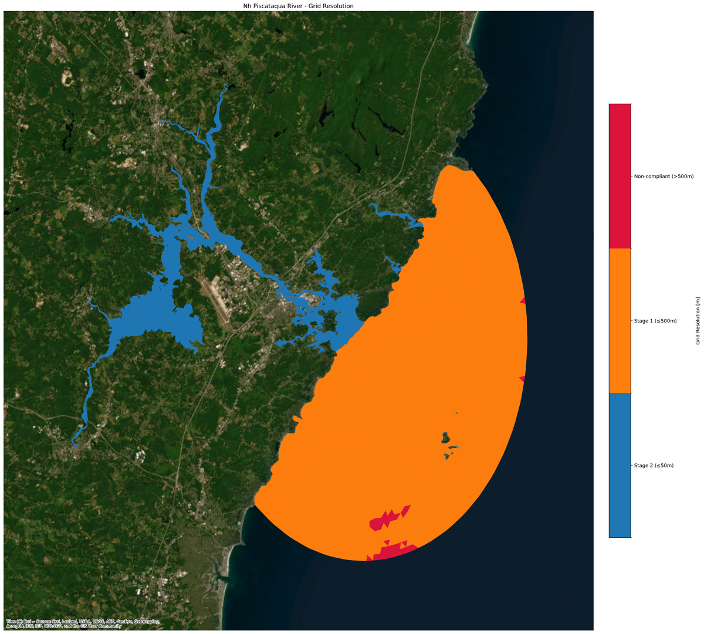
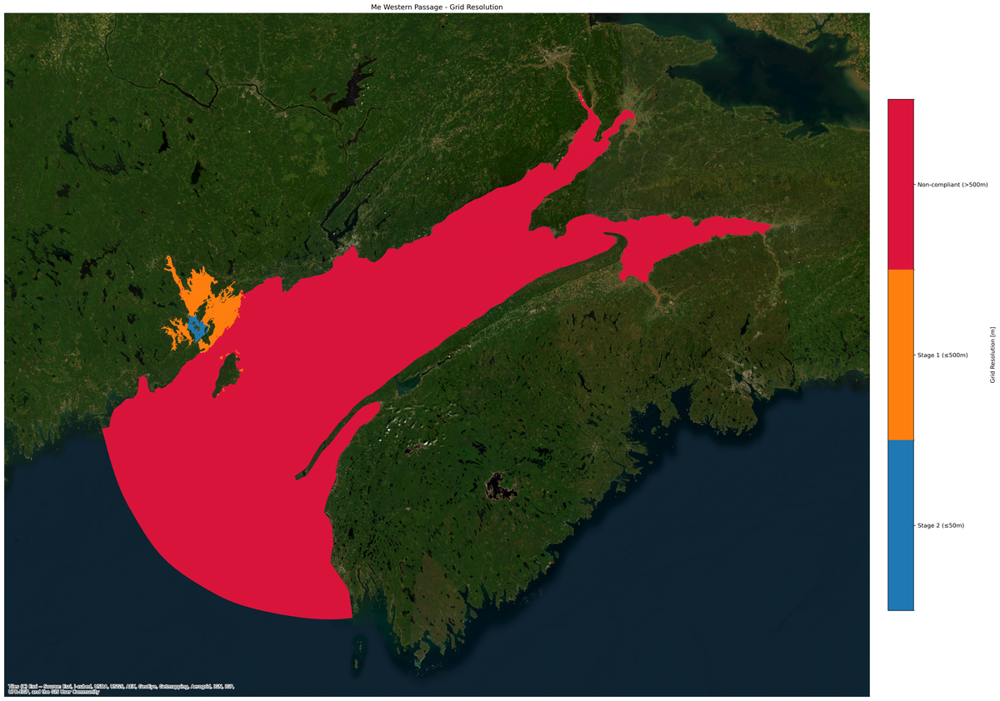
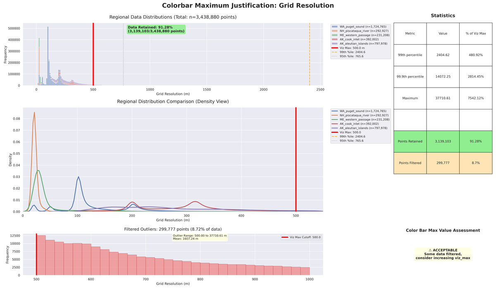
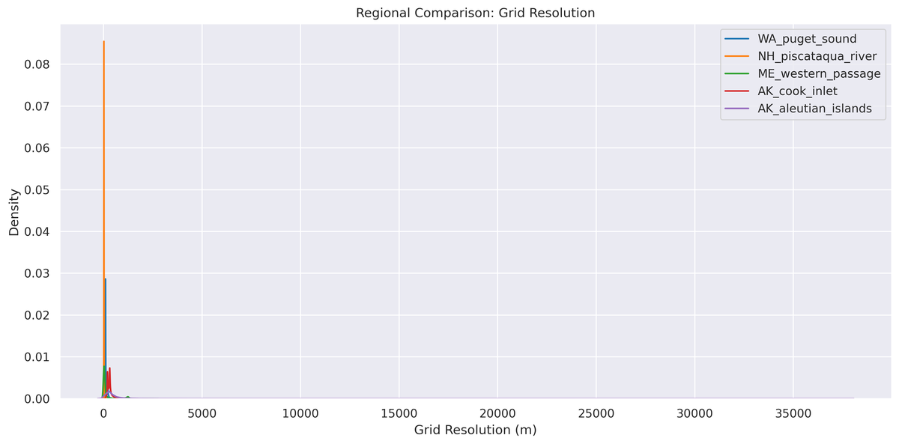

# ME Atlas High Resolution Tidal Data QOI Visualization Specification

The following sections provide the specification for visualizing selected high resolution tidal hindcast variables on the [NLR Marine Energy Atlas](https://maps.nrel.gov/marine-energy-atlas/data-viewer/data-library/layers?vL=WavePowerMerged)

## Available Data File Details

Base directory for all data files:

* <base_dir>: `/projects/hindcastra/Tidal/datasets/high_resolution_tidal_hindcast`

| Location Name | System | File Path |
| --- | --- | --- |
| Puget Sound, Washington | NLR Kestrel HPC | `<base_dir>/WA_puget_sound/b5_vap_summary_parquet/WA_puget_sound.wpto_high_res_tidal-year_average.b4.20150101.000000.parquet` |
| Piscataqua River, New Hampshire | NLR Kestrel HPC | `<base_dir>/NH_piscataqua_river/b5_vap_summary_parquet/NH_piscataqua_river.wpto_high_res_tidal-year_average.b4.20070101.000000.parquet` |
| Western Passage, Maine | NLR Kestrel HPC | `<base_dir>/ME_western_passage/b5_vap_summary_parquet/ME_western_passage.wpto_high_res_tidal-year_average.b4.20170101.000000.parquet` |
| Cook Inlet, Alaska | NLR Kestrel HPC | `<base_dir>/AK_cook_inlet/b5_vap_summary_parquet/AK_cook_inlet.wpto_high_res_tidal-year_average.b4.20050101.000000.parquet` |
| Aleutian Islands, Alaska | NLR Kestrel HPC | `<base_dir>/AK_aleutian_islands/b5_vap_summary_parquet/AK_aleutian_islands.wpto_high_res_tidal-year_average.b4.20100603.000000.parquet` |

## Location Details

| Location Name | Face Count | Averaging Dates [UTC] | Averaging Temporal Resolution
| --- | --- | --- | --- |
| Puget Sound, Washington | 1,734,765 | 2015-01-01 00:00:00 to 2015-12-30 23:30:00 | half-hourly |
| Piscataqua River, New Hampshire | 292,927 | 2007-01-01 00:00:00 to 2007-12-31 23:30:00 | half-hourly |
| Western Passage, Maine | 231,208 | 2017-01-01 00:00:00 to 2017-12-31 23:30:00 | half-hourly |
| Cook Inlet, Alaska | 392,002 | 2005-01-01 00:00:00 to 2005-12-31 23:00:00 | hourly |
| Aleutian Islands, Alaska | 797,978 | 2010-06-03 00:00:00 to 2011-06-02 23:00:00 | hourly |

## Variable Overview

| Variable | Units | Data Column |
| -------- | ----- | ----------- |
| Mean Sea Water Speed | m/s | vap_water_column_mean_sea_water_speed |
| 95th Percentile Sea Water Speed | m/s | vap_water_column_95th_percentile_sea_water_speed |
| Mean Sea Water Power Density | W/m² | vap_water_column_mean_sea_water_power_density |
| 95th Percentile Sea Water Power Density | W/m² | vap_water_column_95th_percentile_sea_water_power_density |
| Mean Depth | m (below NAVD88) | vap_sea_floor_depth |
| Grid Resolution | m | grid_resolution_meters |

## Variable Usage

| Variable | Meaning | Intended Usage
| ---- | ------- | --- |
| Mean Sea Water Speed | Yearly average of depth averaged current speed | Site screening and turbine selection for power generation |
| 95th Percentile Sea Water Speed | 95th percentile of yearly depth maximum current speed | Generator sizing and power electronics design |
| Mean Sea Water Power Density | Yearly average of depth averaged power density (kinetic energy flux) | Resource quantification and economic feasibility analysis |
| 95th Percentile Sea Water Power Density | 95th percentile of the yearly maximum of depth averaged power density (kinetic energy flux) | Structural design loads and extreme loading conditions |
| Mean Depth | Yearly average distance from water surface to the sea floor | Installation planning and foundation design |
| Grid Resolution | Average edge length of triangular finite volume elements | Model accuracy assessment and validation |

## Variable Equations

### Mean Sea Water Speed

Equation:

$\overline{\overline{U}} = U_{\text{average}} = \text{mean}\left(\left[\text{mean}(U_{1,t}, ..., U_{N_{\sigma},t}) \text{ for } t=1,...,T\right]\right)$

Where:

- $U_{i,t} = \sqrt{u_{i,t}^2 + v_{i,t}^2}$ are velocity magnitudes at uniformly distributed sigma level $i$ at volume centers at time $t$ (m/s)
- $N_{\sigma} = 10$ levels
- $T = 1$ year

### 95th Percentile Sea Water Speed

Equation:

$U_{95} = \text{percentile}_{95}\left(\left[\max(U_{1,t}, ..., U_{N_{\sigma},t}) \text{ for } t=1,...,T\right]\right)$

Where:

- $U_{i,t} = \sqrt{u_{i,t}^2 + v_{i,t}^2}$ are velocity magnitudes at uniformly distributed sigma level $i$ at volume centers at time $t$ (m/s)
- $N_{\sigma} = 10$ levels
- $T = 1$ year

### Mean Sea Water Power Density

Equation:

$\overline{\overline{P}} = P_{\text{average}} = \text{mean}\left(\left[\text{mean}(P_{1,t}, ..., P_{N_{\sigma},t}) \text{ for } t=1,...,T\right]\right)$

Where:

- $P_{i,t} = \frac{1}{2} \rho U_{i,t}^3$ with $\rho = 1025$ kg/m³
- $U_{i,t}$ are velocity magnitudes at uniformly distributed sigma level $i$ at volume centers at time $t$
- $N_{\sigma} = 10$ levels
- $T = 1$ year

### 95th Percentile Sea Water Power Density

Equation:

$P_{95} = \text{percentile}_{95}\left(\left[\max(P_{1,t}, ..., P_{N_{\sigma},t}) \text{ for } t=1,...,T\right]\right)$

Where:

- $P_{i,t} = \frac{1}{2} \rho U_{i,t}^3$ with $\rho = 1025$ kg/m³
- $U_{i,t}$ are velocity magnitudes at uniformly distributed sigma level $i$ at volume centers at time $t$
- $N_{\sigma} = 10$ levels
- $T = 1$ year

### Mean Depth

Equation:

$\overline{d} = d_{\text{average}} = \text{mean}\left(\left[(h + \zeta_t) \text{ for } t=1,...,T\right]\right)$

Where:

- $h$ is bathymetry below NAVD88 (m)
- $\zeta_t$ is sea surface elevation above NAVD88 at time $t$ (m)
- $T = 1$ year

### Grid Resolution

Equation:

$\text{Grid Resolution} = \frac{1}{3}(d_1 + d_2 + d_3)$

Where:

- $d_1 = \text{haversine}(\text{lat}_1, \text{lon}_1, \text{lat}_2, \text{lon}_2)$ is the distance between corners 1 and 2
- $d_2 = \text{haversine}(\text{lat}_2, \text{lon}_2, \text{lat}_3, \text{lon}_3)$ is the distance between corners 2 and 3
- $d_3 = \text{haversine}(\text{lat}_3, \text{lon}_3, \text{lat}_1, \text{lon}_1)$ is the distance between corners 3 and 1
- $\text{haversine}(\text{lat}_a, \text{lon}_a, \text{lat}_b, \text{lon}_b) = R \cdot 2\arcsin\left(\sqrt{\sin^2\left(\frac{\Delta\text{lat}}{2}\right) + \cos(\text{lat}_a)\cos(\text{lat}_b)\sin^2\left(\frac{\Delta\text{lon}}{2}\right)}\right)$
- $R = 6378137.0$ m is the Earth radius (WGS84)

## Coordinate Details

The high resolution tidal hindcast data is based on an unstructured three dimensional grid of triangular faces with variable resolution.
To visualize in two dimensions (lat/lon) the data for all depths are combined (averaging, or 95th percentile of maximums) into a single layer.
This single layer has coordinates defined at the center and corners of each triangular element.
Within the parquet files the coordinates are stored in the following columns:

Notes:

* All coordinates are in WGS84 (EPSG:4326) format.
* All centerpoints have been validated to be within the bounding box of the triangular element.
* All triangular elements coordinates are visualized below and can be assumed to be valid
* Triangular elements are not guaranteed to be equilateral or isosceles, and may have varying angles and lengths.
* Triangular elements vertice order has not been validated to be consistent across all regions.
* The Aleutian Islands, Alaska dataset has elements that cross the from -180 to 180 longitude, which may cause visual artifacts in some mapping software.

| Column Name | Description
| --- | --- |
| `lat_center` | Element Center Latitude
| `lon_center` | Element Center Longitude
| `element_corner_1_lat` | Element Triangular Vertice 1 Latitude
| `element_corner_1_lon` | Element Triangular Vertice 1 Longitude
| `element_corner_2_lat` | Element Triangular Vertice 2 Latitude
| `element_corner_2_lon` | Element Triangular Vertice 2 Longitude
| `element_corner_3_lat` | Element Triangular Vertice 3 Latitude
| `element_corner_3_lon` | Element Triangular Vertice 3 Longitude

## Color Details

| Variable | Column Name | Range | Units | Discrete Levels | Colormap |
| -------- | ----------- | ----- | ----- | --------------- | -------- |
| Mean Sea Water Speed | `vap_water_column_mean_sea_water_speed` | 0 - 1.5 | m/s | 10 | thermal |
| 95th Percentile Sea Water Speed | `vap_water_column_95th_percentile_sea_water_speed` | 0.0 - 4.0 | m/s | 8 | matter |
| Mean Sea Water Power Density | `vap_water_column_mean_sea_water_power_density` | 0 - 1750 | W/m² | 7 | dense |
| 95th Percentile Sea Water Power Density | `vap_water_column_95th_percentile_sea_water_power_density` | 0 - 32000 | W/m² | 8 | amp |
| Mean Depth | `vap_sea_floor_depth` | 0 - 200 | m (below NAVD88) | 10 | deep |
| Grid Resolution | `grid_resolution_meters` | 0 - 500 | m | 3 | Custom |

## Color Specifications

The following tables provide exact color specifications for each variable.
All colors use discrete levels with an overflow level for values exceeding the maximum range.

### Mean Sea Water Speed [m/s], `vap_water_column_mean_sea_water_speed`

* **Colormap:** thermal
* **Data Range:** 0 to 1.5 m/s
* **Discrete Levels:** 11 (10 within range + 1 overflow level)

| Level | Value Range | Hex Color | RGB Color | Color Preview |
| ----- | ----------- | --------- | --------- | ------------- |
| 1 | 0.00 - 0.15 [m/s] | `#032333` | `rgb(3, 35, 51)` | $\color[rgb]{0.012, 0.137, 0.200}\rule{40pt}{15pt}$ |
| 2 | 0.15 - 0.30 [m/s] | `#0f3169` | `rgb(15, 49, 105)` | $\color[rgb]{0.059, 0.192, 0.412}\rule{40pt}{15pt}$ |
| 3 | 0.30 - 0.45 [m/s] | `#3f339f` | `rgb(63, 51, 159)` | $\color[rgb]{0.247, 0.200, 0.624}\rule{40pt}{15pt}$ |
| 4 | 0.45 - 0.60 [m/s] | `#674396` | `rgb(103, 67, 150)` | $\color[rgb]{0.404, 0.263, 0.588}\rule{40pt}{15pt}$ |
| 5 | 0.60 - 0.75 [m/s] | `#8a528c` | `rgb(138, 82, 140)` | $\color[rgb]{0.541, 0.322, 0.549}\rule{40pt}{15pt}$ |
| 6 | 0.75 - 0.90 [m/s] | `#b05f81` | `rgb(176, 95, 129)` | $\color[rgb]{0.690, 0.373, 0.506}\rule{40pt}{15pt}$ |
| 7 | 0.90 - 1.05 [m/s] | `#d56b6c` | `rgb(213, 107, 108)` | $\color[rgb]{0.835, 0.420, 0.424}\rule{40pt}{15pt}$ |
| 8 | 1.05 - 1.20 [m/s] | `#f2824c` | `rgb(242, 130, 76)` | $\color[rgb]{0.949, 0.510, 0.298}\rule{40pt}{15pt}$ |
| 9 | 1.20 - 1.35 [m/s] | `#fba53c` | `rgb(251, 165, 60)` | $\color[rgb]{0.984, 0.647, 0.235}\rule{40pt}{15pt}$ |
| 10 | 1.35 - 1.50 [m/s] | `#f6d045` | `rgb(246, 208, 69)` | $\color[rgb]{0.965, 0.816, 0.271}\rule{40pt}{15pt}$ |
| 11 | ≥ 1.500 m/s | `#e7fa5a` | `rgb(231, 250, 90)` | $\color[rgb]{0.906, 0.980, 0.353}\rule{40pt}{15pt}$ |

### 95th Percentile Sea Water Speed [m/s], `vap_water_column_95th_percentile_sea_water_speed`

* **Colormap:** matter
* **Data Range:** 0.0 to 4.0 m/s
* **Discrete Levels:** 9 (8 within range + 1 overflow level)

| Level | Value Range | Hex Color | RGB Color | Color Preview |
| ----- | ----------- | --------- | --------- | ------------- |
| 1 | 0.00 - 0.50 [m/s] | `#fdedb0` | `rgb(253, 237, 176)` | $\color[rgb]{0.992, 0.929, 0.690}\rule{40pt}{15pt}$ |
| 2 | 0.50 - 1.00 [m/s] | `#f9c087` | `rgb(249, 192, 135)` | $\color[rgb]{0.976, 0.753, 0.529}\rule{40pt}{15pt}$ |
| 3 | 1.00 - 1.50 [m/s] | `#f19466` | `rgb(241, 148, 102)` | $\color[rgb]{0.945, 0.580, 0.400}\rule{40pt}{15pt}$ |
| 4 | 1.50 - 2.00 [m/s] | `#e56953` | `rgb(229, 105, 83)` | $\color[rgb]{0.898, 0.412, 0.325}\rule{40pt}{15pt}$ |
| 5 | 2.00 - 2.50 [m/s] | `#ce4356` | `rgb(206, 67, 86)` | $\color[rgb]{0.808, 0.263, 0.337}\rule{40pt}{15pt}$ |
| 6 | 2.50 - 3.00 [m/s] | `#ab2960` | `rgb(171, 41, 96)` | $\color[rgb]{0.671, 0.161, 0.376}\rule{40pt}{15pt}$ |
| 7 | 3.00 - 3.50 [m/s] | `#821b62` | `rgb(130, 27, 98)` | $\color[rgb]{0.510, 0.106, 0.384}\rule{40pt}{15pt}$ |
| 8 | 3.50 - 4.00 [m/s] | `#571656` | `rgb(87, 22, 86)` | $\color[rgb]{0.341, 0.086, 0.337}\rule{40pt}{15pt}$ |
| 9 | ≥ 4.000 m/s | `#2f0f3d` | `rgb(47, 15, 61)` | $\color[rgb]{0.184, 0.059, 0.239}\rule{40pt}{15pt}$ |

### Mean Sea Water Power Density [W/m²], `vap_water_column_mean_sea_water_power_density`

* **Colormap:** dense
* **Data Range:** 0 to 1750 W/m²
* **Discrete Levels:** 8 (7 within range + 1 overflow level)

| Level | Value Range | Hex Color | RGB Color | Color Preview |
| ----- | ----------- | --------- | --------- | ------------- |
| 1 | 0 - 250 [W/m²] | `#e6f0f0` | `rgb(230, 240, 240)` | $\color[rgb]{0.902, 0.941, 0.941}\rule{40pt}{15pt}$ |
| 2 | 250 - 500 [W/m²] | `#aad2e2` | `rgb(170, 210, 226)` | $\color[rgb]{0.667, 0.824, 0.886}\rule{40pt}{15pt}$ |
| 3 | 500 - 750 [W/m²] | `#7db0e3` | `rgb(125, 176, 227)` | $\color[rgb]{0.490, 0.690, 0.890}\rule{40pt}{15pt}$ |
| 4 | 750 - 1000 [W/m²] | `#7487e0` | `rgb(116, 135, 224)` | $\color[rgb]{0.455, 0.529, 0.878}\rule{40pt}{15pt}$ |
| 5 | 1000 - 1250 [W/m²] | `#795cc3` | `rgb(121, 92, 195)` | $\color[rgb]{0.475, 0.361, 0.765}\rule{40pt}{15pt}$ |
| 6 | 1250 - 1500 [W/m²] | `#723693` | `rgb(114, 54, 147)` | $\color[rgb]{0.447, 0.212, 0.576}\rule{40pt}{15pt}$ |
| 7 | 1500 - 1750 [W/m²] | `#5c1957` | `rgb(92, 25, 87)` | $\color[rgb]{0.361, 0.098, 0.341}\rule{40pt}{15pt}$ |
| 8 | ≥ 1750 W/m² | `#360e24` | `rgb(54, 14, 36)` | $\color[rgb]{0.212, 0.055, 0.141}\rule{40pt}{15pt}$ |

### 95th Percentile Sea Water Power Density [W/m²], `vap_water_column_95th_percentile_sea_water_power_density`

* **Colormap:** amp
* **Data Range:** 0 to 32000 W/m²
* **Discrete Levels:** 9 (8 within range + 1 overflow level)

| Level | Value Range | Hex Color | RGB Color | Color Preview |
| ----- | ----------- | --------- | --------- | ------------- |
| 1 | 0 - 4000 [W/m²] | `#f1ecec` | `rgb(241, 236, 236)` | $\color[rgb]{0.945, 0.925, 0.925}\rule{40pt}{15pt}$ |
| 2 | 4000 - 8000 [W/m²] | `#e2c7be` | `rgb(226, 199, 190)` | $\color[rgb]{0.886, 0.780, 0.745}\rule{40pt}{15pt}$ |
| 3 | 8000 - 12000 [W/m²] | `#d7a290` | `rgb(215, 162, 144)` | $\color[rgb]{0.843, 0.635, 0.565}\rule{40pt}{15pt}$ |
| 4 | 12000 - 16000 [W/m²] | `#cc7d63` | `rgb(204, 125, 99)` | $\color[rgb]{0.800, 0.490, 0.388}\rule{40pt}{15pt}$ |
| 5 | 16000 - 20000 [W/m²] | `#bf583a` | `rgb(191, 88, 58)` | $\color[rgb]{0.749, 0.345, 0.227}\rule{40pt}{15pt}$ |
| 6 | 20000 - 24000 [W/m²] | `#ae2e24` | `rgb(174, 46, 36)` | $\color[rgb]{0.682, 0.180, 0.141}\rule{40pt}{15pt}$ |
| 7 | 24000 - 28000 [W/m²] | `#8e1028` | `rgb(142, 16, 40)` | $\color[rgb]{0.557, 0.063, 0.157}\rule{40pt}{15pt}$ |
| 8 | 28000 - 32000 [W/m²] | `#640e23` | `rgb(100, 14, 35)` | $\color[rgb]{0.392, 0.055, 0.137}\rule{40pt}{15pt}$ |
| 9 | ≥ 32000 W/m² | `#3c0911` | `rgb(60, 9, 17)` | $\color[rgb]{0.235, 0.035, 0.067}\rule{40pt}{15pt}$ |

### Mean Depth [m (below NAVD88)], `vap_sea_floor_depth`

* **Colormap:** deep
* **Data Range:** 0 to 200 m (below NAVD88)
* **Discrete Levels:** 11 (10 within range + 1 overflow level)

| Level | Value Range | Hex Color | RGB Color | Color Preview |
| ----- | ----------- | --------- | --------- | ------------- |
| 1 | 0.00 - 20.00 [m (below NAVD88)] | `#fdfdcc` | `rgb(253, 253, 204)` | $\color[rgb]{0.992, 0.992, 0.800}\rule{40pt}{15pt}$ |
| 2 | 20.00 - 40.00 [m (below NAVD88)] | `#c9ebb1` | `rgb(201, 235, 177)` | $\color[rgb]{0.788, 0.922, 0.694}\rule{40pt}{15pt}$ |
| 3 | 40.00 - 60.00 [m (below NAVD88)] | `#91d8a3` | `rgb(145, 216, 163)` | $\color[rgb]{0.569, 0.847, 0.639}\rule{40pt}{15pt}$ |
| 4 | 60.00 - 80.00 [m (below NAVD88)] | `#66c2a3` | `rgb(102, 194, 163)` | $\color[rgb]{0.400, 0.761, 0.639}\rule{40pt}{15pt}$ |
| 5 | 80 - 100 [m (below NAVD88)] | `#51a8a2` | `rgb(81, 168, 162)` | $\color[rgb]{0.318, 0.659, 0.635}\rule{40pt}{15pt}$ |
| 6 | 100 - 120 [m (below NAVD88)] | `#488d9d` | `rgb(72, 141, 157)` | $\color[rgb]{0.282, 0.553, 0.616}\rule{40pt}{15pt}$ |
| 7 | 120 - 140 [m (below NAVD88)] | `#407598` | `rgb(64, 117, 152)` | $\color[rgb]{0.251, 0.459, 0.596}\rule{40pt}{15pt}$ |
| 8 | 140 - 160 [m (below NAVD88)] | `#3d5a92` | `rgb(61, 90, 146)` | $\color[rgb]{0.239, 0.353, 0.573}\rule{40pt}{15pt}$ |
| 9 | 160 - 180 [m (below NAVD88)] | `#41407b` | `rgb(65, 64, 123)` | $\color[rgb]{0.255, 0.251, 0.482}\rule{40pt}{15pt}$ |
| 10 | 180 - 200 [m (below NAVD88)] | `#372c50` | `rgb(55, 44, 80)` | $\color[rgb]{0.216, 0.173, 0.314}\rule{40pt}{15pt}$ |
| 11 | ≥ 200.0 m (below NAVD88) | `#271a2c` | `rgb(39, 26, 44)` | $\color[rgb]{0.153, 0.102, 0.173}\rule{40pt}{15pt}$ |

### Grid Resolution [m], `grid_resolution_meters`

* **Colormap:** Custom
* **Data Range:** 0 to 500 m
* **Discrete Levels:** 4 (3 within range + 1 overflow level)

| Level | Value Range | Hex Color | RGB Color | Color Preview |
| ----- | ----------- | --------- | --------- | ------------- |
| 1 | 0.00 - 50.00 [m] | `#1f77b4` | `rgb(31, 119, 180)` | $\color[rgb]{0.122, 0.467, 0.706}\rule{40pt}{15pt}$ |
| 2 | 50 - 500 [m] | `#ff7f0e` | `rgb(255, 127, 14)` | $\color[rgb]{1.000, 0.498, 0.055}\rule{40pt}{15pt}$ |
| 3 | ≥ 500.0 m | `#dc143c` | `rgb(220, 20, 60)` | $\color[rgb]{0.863, 0.078, 0.235}\rule{40pt}{15pt}$ |

## Visualizations by Variable

### Mean Sea Water Speed

**Puget Sound, Washington Mean Sea Water Speed**

*Figure: Mean Sea Water Speed spatial distribution for Puget Sound, Washington. Units: m/s*

**Piscataqua River, New Hampshire Mean Sea Water Speed**

*Figure: Mean Sea Water Speed spatial distribution for Piscataqua River, New Hampshire. Units: m/s*

**Western Passage, Maine Mean Sea Water Speed**

*Figure: Mean Sea Water Speed spatial distribution for Western Passage, Maine. Units: m/s*

**Cook Inlet, Alaska Mean Sea Water Speed**

*Figure: Mean Sea Water Speed spatial distribution for Cook Inlet, Alaska. Units: m/s*

**Aleutian Islands, Alaska Mean Sea Water Speed**

*Figure: Mean Sea Water Speed spatial distribution for Aleutian Islands, Alaska. Units: m/s*

---

### 95th Percentile Sea Water Speed

**Puget Sound, Washington 95th Percentile Sea Water Speed**

*Figure: 95th Percentile Sea Water Speed spatial distribution for Puget Sound, Washington. Units: m/s*

**Piscataqua River, New Hampshire 95th Percentile Sea Water Speed**

*Figure: 95th Percentile Sea Water Speed spatial distribution for Piscataqua River, New Hampshire. Units: m/s*

**Western Passage, Maine 95th Percentile Sea Water Speed**

*Figure: 95th Percentile Sea Water Speed spatial distribution for Western Passage, Maine. Units: m/s*

**Cook Inlet, Alaska 95th Percentile Sea Water Speed**

*Figure: 95th Percentile Sea Water Speed spatial distribution for Cook Inlet, Alaska. Units: m/s*

**Aleutian Islands, Alaska 95th Percentile Sea Water Speed**

*Figure: 95th Percentile Sea Water Speed spatial distribution for Aleutian Islands, Alaska. Units: m/s*

---

### Mean Sea Water Power Density

**Puget Sound, Washington Mean Sea Water Power Density**

*Figure: Mean Sea Water Power Density spatial distribution for Puget Sound, Washington. Units: W/m²*

**Piscataqua River, New Hampshire Mean Sea Water Power Density**

*Figure: Mean Sea Water Power Density spatial distribution for Piscataqua River, New Hampshire. Units: W/m²*

**Western Passage, Maine Mean Sea Water Power Density**

*Figure: Mean Sea Water Power Density spatial distribution for Western Passage, Maine. Units: W/m²*

**Cook Inlet, Alaska Mean Sea Water Power Density**

*Figure: Mean Sea Water Power Density spatial distribution for Cook Inlet, Alaska. Units: W/m²*

**Aleutian Islands, Alaska Mean Sea Water Power Density**

*Figure: Mean Sea Water Power Density spatial distribution for Aleutian Islands, Alaska. Units: W/m²*

---

### 95th Percentile Sea Water Power Density

**Puget Sound, Washington 95th Percentile Sea Water Power Density**

*Figure: 95th Percentile Sea Water Power Density spatial distribution for Puget Sound, Washington. Units: W/m²*

**Piscataqua River, New Hampshire 95th Percentile Sea Water Power Density**

*Figure: 95th Percentile Sea Water Power Density spatial distribution for Piscataqua River, New Hampshire. Units: W/m²*

**Western Passage, Maine 95th Percentile Sea Water Power Density**

*Figure: 95th Percentile Sea Water Power Density spatial distribution for Western Passage, Maine. Units: W/m²*

**Cook Inlet, Alaska 95th Percentile Sea Water Power Density**

*Figure: 95th Percentile Sea Water Power Density spatial distribution for Cook Inlet, Alaska. Units: W/m²*

**Aleutian Islands, Alaska 95th Percentile Sea Water Power Density**

*Figure: 95th Percentile Sea Water Power Density spatial distribution for Aleutian Islands, Alaska. Units: W/m²*

---

### Mean Depth

**Puget Sound, Washington Mean Depth**

*Figure: Mean Depth spatial distribution for Puget Sound, Washington. Units: m (below NAVD88)*

**Piscataqua River, New Hampshire Mean Depth**

*Figure: Mean Depth spatial distribution for Piscataqua River, New Hampshire. Units: m (below NAVD88)*

**Western Passage, Maine Mean Depth**

*Figure: Mean Depth spatial distribution for Western Passage, Maine. Units: m (below NAVD88)*

**Cook Inlet, Alaska Mean Depth**

*Figure: Mean Depth spatial distribution for Cook Inlet, Alaska. Units: m (below NAVD88)*

**Aleutian Islands, Alaska Mean Depth**

*Figure: Mean Depth spatial distribution for Aleutian Islands, Alaska. Units: m (below NAVD88)*

---

### Grid Resolution

**Puget Sound, Washington Grid Resolution**

*Figure: Grid Resolution spatial distribution for Puget Sound, Washington. Units: m*

**Piscataqua River, New Hampshire Grid Resolution**

*Figure: Grid Resolution spatial distribution for Piscataqua River, New Hampshire. Units: m*

**Western Passage, Maine Grid Resolution**

*Figure: Grid Resolution spatial distribution for Western Passage, Maine. Units: m*

**Cook Inlet, Alaska Grid Resolution**

*Figure: Grid Resolution spatial distribution for Cook Inlet, Alaska. Units: m*

**Aleutian Islands, Alaska Grid Resolution**

*Figure: Grid Resolution spatial distribution for Aleutian Islands, Alaska. Units: m*

---

## Cross-Regional Comparative Analysis

Comparative visualizations across all processed regions provide insights into spatial variability, statistical patterns, and visualization parameter validation.

### Visualization Maximum Justification

These comprehensive plots validate the chosen visualization maximum (viz_max) parameters used throughout the analysis. Each visualization demonstrates that the selected cutoff values effectively capture the bulk of the data while filtering extreme outliers, ensuring meaningful and readable visualizations.

### Visualization Methodology Notes

**Visualization Maximum (Viz Max) Approach**: All visualizations use validated maximum values that capture 95-99.9% of the data while filtering extreme outliers. This approach ensures:

- Clear, readable visualizations without distortion from extreme values
- Consistent scales across regional comparisons
- Transparent documentation of data filtering decisions
- Preservation of statistical integrity for the bulk of the dataset

**Data Retention**: The following justification plots show exactly what percentage of data is retained vs. filtered, providing full transparency about the visualization choices and their impact on the analysis.

**Mean Sea Water Speed - Visualization Maximum Validation**

*Figure: Comprehensive validation of visualization maximum for mean sea water speed. Shows full data distribution, regional comparisons within bounds, key statistics, and outlier assessment. Units: m/s. Validates the visualization maximum used for mean sea water speed analysis, showing data retention rates and outlier filtering effectiveness.*

**95th Percentile Sea Water Speed - Visualization Maximum Validation**

*Figure: Comprehensive validation of visualization maximum for 95th percentile sea water speed. Shows full data distribution, regional comparisons within bounds, key statistics, and outlier assessment. Units: m/s. Validates the visualization maximum used for 95th percentile sea water speed analysis, showing data retention rates and outlier filtering effectiveness.*

**Mean Sea Water Power Density - Visualization Maximum Validation**

*Figure: Comprehensive validation of visualization maximum for mean sea water power density. Shows full data distribution, regional comparisons within bounds, key statistics, and outlier assessment. Units: W/m². Validates the visualization maximum used for mean sea water power density analysis, showing data retention rates and outlier filtering effectiveness.*

**95th Percentile Sea Water Power Density - Visualization Maximum Validation**

*Figure: Comprehensive validation of visualization maximum for 95th percentile sea water power density. Shows full data distribution, regional comparisons within bounds, key statistics, and outlier assessment. Units: W/m². Validates the visualization maximum used for 95th percentile sea water power density analysis, showing data retention rates and outlier filtering effectiveness.*

**Mean Depth - Visualization Maximum Validation**

*Figure: Comprehensive validation of visualization maximum for mean depth. Shows full data distribution, regional comparisons within bounds, key statistics, and outlier assessment. Units: m (below NAVD88). Validates the visualization maximum used for mean depth analysis, showing data retention rates and outlier filtering effectiveness.*

**Grid Resolution - Visualization Maximum Validation**

*Figure: Comprehensive validation of visualization maximum for grid resolution. Shows full data distribution, regional comparisons within bounds, key statistics, and outlier assessment. Units: m. Validates the visualization maximum used for grid resolution analysis, showing data retention rates and outlier filtering effectiveness.*

### Regional Distribution Comparisons

These kernel density estimation (KDE) plots provide clean statistical comparisons of variable distributions across all processed regions, focused within the validated visualization ranges.

**Mean Sea Water Speed Distribution Comparison**

*Figure: Kernel density estimation comparison of mean sea water speed across all processed regions. Units: m/s. Mean Sea Water Speed distribution comparison across regions. Distributions are shown within validated visualization bounds for optimal clarity.*

**95th Percentile Sea Water Speed Distribution Comparison**

*Figure: Kernel density estimation comparison of 95th percentile sea water speed across all processed regions. Units: m/s. 95th Percentile Sea Water Speed distribution comparison across regions. Distributions are shown within validated visualization bounds for optimal clarity.*

**Mean Sea Water Power Density Distribution Comparison**

*Figure: Kernel density estimation comparison of mean sea water power density across all processed regions. Units: W/m². Mean Sea Water Power Density distribution comparison across regions. Distributions are shown within validated visualization bounds for optimal clarity.*

**95th Percentile Sea Water Power Density Distribution Comparison**

*Figure: Kernel density estimation comparison of 95th percentile sea water power density across all processed regions. Units: W/m². 95th Percentile Sea Water Power Density distribution comparison across regions. Distributions are shown within validated visualization bounds for optimal clarity.*

**Mean Depth Distribution Comparison**

*Figure: Kernel density estimation comparison of mean depth across all processed regions. Units: m (below NAVD88). Mean Depth distribution comparison across regions. Distributions are shown within validated visualization bounds for optimal clarity.*

**Grid Resolution Distribution Comparison**

*Figure: Kernel density estimation comparison of grid resolution across all processed regions. Units: m. Grid Resolution distribution comparison across regions. Distributions are shown within validated visualization bounds for optimal clarity.*

---

## Document Information

- **Generated:** 2025-06-24 14:50:12 UTC
- **Regions Processed:** WA_puget_sound, NH_piscataqua_river, ME_western_passage, AK_cook_inlet, AK_aleutian_islands

*This specification was auto-generated from the tidal data visualization pipeline.*
*All color codes, ranges, and technical specifications are programmatically derived.*
